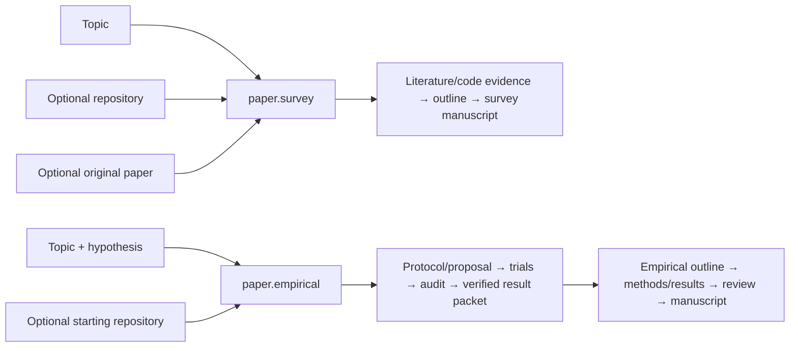

# MrMaLiang

MrMaLiang is a unified, evidence-first workflow for producing long-form
research artifacts: literature surveys, repository studies, audited experiment
suites, and empirical papers that join those results. Its one public CLI is
`maliang`.

MrMaLiang coordinates two internal components:

- **LongWrite** gathers and verifies literature/code evidence, plans and writes
  manuscripts, renders PDF/LaTeX, and applies review/release gates.
- **LongExperiment** designs controlled study suites, locks inputs, runs a
  reviewed executor, audits trial records, and emits a checksummed experiment
  manifest.

[MalaClaw](https://github.com/gozhiyuan/MalaClaw) remains an external workflow
runtime. It owns durable flow state, approvals, retries, quotas, and worker
execution. MrMaLiang owns the research-specific evidence and handoff contracts.

## A small origin story

The name comes from **Shen Bi Ma Liang** (神笔马良), the Chinese folk tale about
Ma Liang and a magic brush whose drawings can become real. Here, Ma Liang has
grown up into **MrMaLiang**: instead of drawing objects into existence, he uses
bounded, evidence-first agent workflows to help turn a research brief into a
long survey, repository study, controlled experiment, or book-length draft.

The magic is deliberately constrained. A useful figure still needs verified
metadata or evidence; a scholarly claim still needs a traceable source; and an
empirical result still needs audited trials. MrMaLiang helps with the long,
iterative craft of writing without pretending that evidence or scientific
results can be conjured from nothing.

## Development and recommended runtime

MrMaLiang is developed with **OpenAI Codex 5.6 models**. For live flagship
runs, we recommend the local `codex` runtime with an active Codex subscription:
it is the most exercised configuration for the agentic planning, drafting, and
review stages in this repository. Complete the local Codex CLI login before
running `maliang preflight … --runtime codex`.

Codex is recommended, not mandatory. MalaClaw can also use a supported
Claude/Claude Code runtime, and the offline `seed` + `dry-run` combination is
available for a no-quota smoke test.

## What to use it for

| Goal | Start with | Uses |
| --- | --- | --- |
| Long literature survey | `paper.survey` | LongWrite |
| Survey or architecture study of a GitHub/local repository | `paper.survey --repository …` | LongWrite + pinned code evidence; no execution |
| Audited benchmark/model experiment without a paper | `experiment.*` | LongExperiment; prescribed protocols remain incubating |
| New experiment paper, optionally starting from a repository | `paper.empirical` | LongExperiment → verified handoff → LongWrite |
| Experiment paper with a human-supplied protocol/runner | `paper.empirical --experiment-authoring prescribed` | Prescribed LongExperiment → verified handoff → LongWrite |
| Paper from an existing audited experiment bundle | `paper.empirical-import` | LongWrite only; optional repository binding |
| Novel or technical book | `writing.novel` / `writing.technical-book` | LongWrite |

The project does not fabricate experimental results: empirical claims require
an audited LongExperiment manifest. It also does not promise a fixed page count
or a scientific discovery outcome; templates set measurable output targets and
report failed gates honestly.

## Three public paper modes

Users choose the research action, not a Cartesian product of internal axes:

| Public mode | Inputs | What MrMaLiang does |
| --- | --- | --- |
| `paper.survey` | Topic, optional `--repository`, `--discover-repositories`, and `--reference-link` | Searches literature, optionally indexes pinned code, and writes a source-grounded survey. It never runs experiments. |
| `paper.empirical` | Topic, hypothesis, optional repository, optional `--experiment-authoring` | Runs a controlled agentic or prescribed experiment, audits it, then writes from the verified result packet. |
| `paper.empirical-import` | Existing audited manifest, optional repository | Runs no experiment; verifies and imports an existing result bundle before writing. |

Supplying a GitHub or local repository **never selects experiment mode**. With
`paper.survey`, it only changes the evidence profile from literature to
repository and creates no LongExperiment component. New execution happens only
when the operator explicitly selects `paper.empirical`.

MrMaLiang resolves the public choice into four internal declarations, stores
them in `maliang.yaml`, and checks them before running either component:

| Axis | Values | Meaning |
| --- | --- | --- |
| Paper kind | `survey` / `empirical` | Whether the manuscript reports new experimental results. |
| Evidence profile | `literature` / `repository` | Whether a pinned existing codebase is central evidence. |
| Experiment source | `none` / `run` / `import` | Whether experiment evidence is absent, newly executed, or imported as an audited bundle. |
| Experiment authoring | `prescribed` / `agentic` | Whether a human supplies the runner/protocol or the LLM proposes and implements a bounded candidate. This applies only when source is `run`. |

The initializer infers `evidenceProfile: repository` from `--repository` or
`--discover-repositories` and
defaults new experiments to `experimentAuthoring: agentic`. Passing
`--experiment-authoring prescribed` changes only who supplies the protocol and
runner. Surveys reject experiment options; imports reject authoring options;
`run` requires LongExperiment; and `import` remains blocked until a valid
manifest is handed off. Repository empirical initialization additionally binds
the same immutable Git commit into the experiment and paper. Blueprints select
these modes—they do not execute Markdown instructions. Use
`maliang template list` to see each public contract or
`maliang template show <id>` to inspect its component and handoff contract.

Recognized arXiv, DOI, and OpenReview `--reference-link` values are resolved
exactly and inserted as authoritative scholarly recall seeds. A failed exact
resolution stops a live run. Other URLs remain unverified scope/style context.
GitHub discovery is bounded and opt-in: scripts search and filter metadata,
the LLM selects relevant candidates, and scripts reject duplicates before Git
pins any selection. Mentioned repositories found in pinned README/CITATION
content are only written to an operator candidate list; they are never crawled
recursively.

```bash
maliang init related-software-survey \
  --template paper.survey \
  --topic "Agent memory systems and their implementation patterns" \
  --discover-repositories \
  --repository-query-budget 4 \
  --repository-max-selected 3 \
  --repository-language Python TypeScript
```

For a custom integrated run, choose the preset explicitly:

```bash
# LLM proposes and authors the bounded experiment.
maliang init new-discovery \
  --template paper.empirical \
  --topic "A controlled intervention" \
  --hypothesis "The intervention improves the fixed primary metric."

# A human supplies the protocol/runner in experiment/experiment.yaml.
maliang init prescribed-study \
  --template paper.empirical \
  --experiment-authoring prescribed \
  --topic "Evaluation of a declared protocol" \
  --hypothesis "The declared treatment improves the fixed primary metric."

# Supplying a repository pins a starting codebase but does not otherwise change
# the experiment command.
maliang init repository-experiment \
  --template paper.empirical \
  --topic "A controlled repository intervention" \
  --hypothesis "The intervention improves the fixed primary metric." \
  --repository https://github.com/example/project.git

# No experiment is run; an existing audited manifest is verified and imported.
maliang init imported-study \
  --template paper.empirical-import \
  --topic "Analysis of an audited result bundle"
maliang handoff import imported-study --manifest /absolute/path/to/experiment-manifest.json
```

The prescribed scaffold intentionally fails preflight until its pinned inputs,
primary metric/direction, baseline and treatment conditions, repeated seeds,
trial ceiling, and runner are explicitly configured. The agentic scaffold
supplies a bounded envelope but still requires the operator to review it.

When an existing repository has a paper, figures, or README result tables but
does not have an audited MrMaLiang-compatible manifest with per-trial evidence,
use `paper.survey`. Cite the original paper for its experimental conclusions and
describe them as results reported by the authors. Do not select import merely
because the upstream publication is empirical.

### Survey versus experiment boundary



Survey mode may accurately summarize an upstream experiment, but it attributes
the finding to that source. Experiment mode adds LongExperiment before writing
and exposes only its verified comparison packet to outline, drafting, visual,
review, and release stages. Repository code, README prose, screenshots, and
runner logs can never substitute for that packet.

## Prerequisites

Required for all workflows:

- Node.js **22+** and npm
- [MalaClaw](https://github.com/gozhiyuan/MalaClaw) **>=1.0.0 <2.0.0** on `PATH`
- Git, for repository studies and immutable input pins

Required for a real survey or manuscript run:

- **Recommended:** an authenticated `codex` runtime with an active Codex
  subscription. It is the primary live-run configuration used to develop this
  repository.
- Alternatively, an authenticated `claude`/`claude-code` runtime
- A LaTeX engine (`tectonic` or `latexmk`) for final PDF output
- `pdftotext`, Mermaid CLI, and Matplotlib only when their selected evidence or
  figure features require them

Required only for agent-authored experiment flagships:

- Pinned code/model/benchmark inputs and a declared trial budget
- Python/PyTorch and suitable local hardware for the selected workload
- Human approval of the proposal, generated code before any test/smoke
  execution, and full-trial compute after smoke

The two agentic empirical flagships currently run their generated Python
entrypoints on the MalaClaw worker host. Modal is supported by the prescribed
remote-job runner contract, but is not automatically substituted for these
agent-authored entrypoints. Surveys never need Modal.

## Shared optional integrations and environment

The available workflows share this setup. Configure only the capabilities you
actually select; a missing optional key is reported by preflight rather than
silently replaced. Keep writing credentials in `<workspace>/writing/.env`,
which is ignored by Git:

```bash
cd <workspace>/writing
cp .env.example .env
```

| Capability | Required for | Credential or setup | Where it belongs |
| --- | --- | --- | --- |
| Codex or Claude Code harness | Any live writing run | Complete the local CLI login. | Local runtime login; not `.env` by default. |
| Broad scholarly recall | Deep survey/repository survey (recommended) | `OPENALEX_API_KEY`, `SEMANTIC_SCHOLAR_API_KEY` | `writing/.env` |
| GitHub metadata and private/rate-limited repository access | Repository studies (optional for public clone) | `GITHUB_TOKEN` | `writing/.env` |
| Hybrid embedding retrieval or direct API worker | Only when enabled in `longwrite.yaml` | `OPENAI_API_KEY` / `ANTHROPIC_API_KEY` / `GEMINI_API_KEY` (or the matching `MALACLAW_*` key) | `writing/.env` |
| Nano Banana conceptual illustration | Only when explicitly enabled and approved | `LONGWRITE_NANOBANANA_API_KEY`, or `GEMINI_API_KEY` / `GOOGLE_API_KEY` | `writing/.env` |
| Remote GPU experiments | Prescribed Modal runner after its local adapter smoke test | Modal login, or `MODAL_TOKEN_ID` + `MODAL_TOKEN_SECRET` for unattended jobs | Trusted launcher environment or secrets manager—**never** workspace `.env`, YAML, or Git. |

Nano Banana is optional and limited to an explicitly approved, non-evidentiary
conceptual illustration. It must never stand in for a source-grounded diagram,
comparison table, metadata plot, or experimental result. The detailed
configuration and approval contract is in the [long survey runbook](docs/flagships/long-agentic-survey.md#9-optional-nano-banana-conceptual-diagram).

For Modal account setup, remote-job adapters, cancellation, and conservative
first-pilot caps, see [Remote GPU / Modal setup](docs/remote-gpu-modal.md).
Surveys and repository studies do not need Modal or a GPU.

## Install from source

```bash
git clone https://github.com/gozhiyuan/MrMaLiang.git
cd MrMaLiang

node --version                 # v22 or newer
malaclaw --version             # >=1.0.0 <2.0.0
npm install
npm run build
npm link --workspace @mr-maliang/maliang

maliang --version
maliang template list
```

From an unlinked checkout, replace `maliang …` below with `npm run maliang -- …`.
LongWrite and LongExperiment commands are internal component interfaces; do not
install them globally for new workspaces.

## First run: free survey smoke test

Complete [Install from source](#install-from-source) first: this smoke test
still requires Node 22+, MalaClaw on `PATH`, and the built `maliang` command.
It intentionally uses the offline `seed` provider and `dry-run` runtime, so it
requires **none** of the optional keys or LLM/Modal setup above. Configure
[Shared optional integrations and environment](#shared-optional-integrations-and-environment)
only before a live survey, repository study, image-generation feature, or
remote experiment.

Run the smoke test before spending model quota or configuring a real survey:

```bash
maliang init survey-smoke \
  --template paper.survey \
  --topic "Tool use and environment feedback in LLM agents" \
  -- \
  --research-provider seed \
  --target-length-words 1200 \
  --output-format markdown pdf

maliang preflight survey-smoke --runtime dry-run
maliang run survey-smoke --runtime dry-run
maliang writing approve survey-smoke --batch
maliang run survey-smoke --runtime dry-run
```

The first run pauses at the outline approval gate. The second run completes the
offline fixture workflow. A live `multi`-provider survey uses the same lifecycle
with `--runtime codex` or `--runtime claude-code`.

## Flagship runs

Every flagship has a detailed runbook in [docs/flagships](docs/flagships/) and
a versioned starting configuration in [examples/flagships](examples/flagships/).
`maliang init --blueprint <id>` reads the machine-readable blueprint and
materializes the matching workspace configuration.

| Flagship | Start command | Compute |
| --- | --- | --- |
| [Long agentic survey](docs/flagships/long-agentic-survey.md) | `maliang init llm-memory-agentic --blueprint long-agentic-survey` | Codex/Claude; no GPU |
| [Repository survey](docs/flagships/repository-survey.md) | `maliang init repo-study --blueprint repository-survey --repository <Git-URL-or-local-Git-path>` | Codex/Claude; no GPU |
| [nanoGPT agentic empirical paper](docs/flagships/nanogpt-agentic-empirical-paper.md) | `maliang init nanogpt-agentic-paper --blueprint nanogpt-agentic-empirical-paper` | Codex/Claude + local Python/PyTorch compute |
| [Self-play autonomous empirical paper](docs/flagships/self-play-autonomous-empirical-paper.md) | `maliang init self-play-agentic-paper --blueprint self-play-autonomous-empirical-paper` | Codex/Claude + local model/benchmark compute |

Recommended validation order: survey smoke → long survey → repository survey →
nanoGPT local pilot → self-play local pilot. The first two are validated writing
flagships. The empirical workflows are executable release candidates with
complete contracts and runbooks, but they do not ship precomputed scientific
results; promote a result only after a real run passes every audit and paper
release gate.

### Run a 60+ page-target survey

```bash
maliang init llm-memory-agentic --blueprint long-agentic-survey
maliang preflight llm-memory-agentic --runtime codex
maliang run llm-memory-agentic --runtime codex
```

The blueprint configures a 24,000-word target, 60-page minimum, 80 woven
sources, six figures, twelve tables, and author–year citations. Actual pages
depend on content and layout; the release report records whether each gate was
met.

### Run a repository survey

```bash
maliang init repo-study \
  --blueprint repository-survey \
  --repository https://github.com/your-org/your-repository.git

maliang preflight repo-study --runtime codex
maliang run repo-study --runtime codex
```

The codebase is cloned and resolved to an immutable commit before the paper can
cite implementation evidence. The survey still gathers scholarly literature for
context and comparison.

### Run a repository experiment and empirical paper

```bash
maliang init nanogpt-agentic-paper \
  --blueprint nanogpt-agentic-empirical-paper
maliang preflight nanogpt-agentic-paper --runtime codex
maliang run nanogpt-agentic-paper --runtime codex
```

This path first uses literature and the pinned nanoGPT codebase to propose and
test a bounded intervention. After explicit design and full-trial approvals,
LongExperiment freezes and audits the multi-seed result; only then can LongWrite
use it as empirical evidence. Follow the dedicated runbook before spending
compute.

### Run a from-scratch autonomous empirical paper

```bash
maliang init self-play-agentic-paper \
  --blueprint self-play-autonomous-empirical-paper
maliang preflight self-play-agentic-paper --runtime codex
maliang run self-play-agentic-paper --runtime codex
```

Here “from scratch” means no central implementation repository. Public
benchmark/model revisions and the evaluation envelope remain fixed; the LLM
authors only the bounded candidate project.

### Continue after an approval gate

```bash
maliang writing review agenda <workspace>
maliang writing approve <workspace> <approval-id>
maliang run <workspace> --runtime codex
```

### Optional dashboard

The MalaClaw dashboard can create and edit survey workspaces through the
**MrMaLiang** tab. It accepts a parent MrMaLiang workspace and offers **Browse
folders** for local selection. Its **Repository evidence** field accepts one Git URL or
local Git path per line. A non-empty field selects the repository-study
evidence profile; it does not execute the repository or start an experiment.

```bash
maliang writing dashboard --install-only
malaclaw dashboard-extensions doctor
maliang writing dashboard
```

The dashboard exposes the pinned-code manifest, validated architecture dossier,
and locator-repair report alongside normal outline/review/build artifacts. The
CLI blueprint remains the recommended reproducible starting point for a
flagship run.

## Workspace and repository structure

A workspace has one public parent and fixed component subdirectories:

```text
my-project/
  maliang.yaml                 # template and component lifecycle contract
  writing/                     # present for writing/paper templates
    longwrite.yaml             # editable writing/research configuration
    .env                       # local secrets; never commit
    evidence/  reports/  paper/
  experiment/                  # present for experiment/empirical templates
    experiment.yaml            # runner, pins, trials, and suite contract
    results/  reports/
  reports/
    maliang-preflight.json
```

The monorepo is structured similarly:

```text
apps/maliang/                  # public CLI, templates, lifecycle coordinator
packages/longwrite/            # literature/code evidence, drafting, rendering
packages/longexperiment/       # study suites, result audit, manifests
packages/research-protocol/    # shared evidence, result, and provenance schemas
examples/flagships/            # versioned full-config blueprints
docs/flagships/                # canonical operator runbooks
```

Completed runs are deliberately not committed: PDFs, full text, chunks, SQLite
indexes, logs, and model artifacts can be large or sensitive. Keep final
outputs with `reports/run-provenance.json`, checksums, and a verified archive.

## Useful commands

```bash
npm run build                  # build all workspaces
npm test                       # complete test suite
npm run release:check          # build + tests + template catalog

maliang template list
maliang status <workspace>
maliang provenance <workspace>
maliang preflight <workspace>
maliang run <workspace> --runtime <runtime>
maliang writing --help
maliang experiment --help
```

MalaClaw remains intentionally separate for runtime inspection and advanced
flow operations:

```bash
malaclaw flow runtimes
(cd <workspace>/writing && malaclaw validate)
```

## References and related projects

MrMaLiang’s architecture is informed by, but does not claim to reproduce, the
following projects and published frameworks:

- [MalaClaw](https://github.com/gozhiyuan/MalaClaw) — durable agent-workflow runtime
- [Deli AutoResearch / AutoResearch V2](https://victorchen96.github.io/auto_research/framework.html) — long-horizon autonomous research reference
- [AutoScientists](https://github.com/mims-harvard/AutoScientists) — external autonomous-science runner integration
- [nanoGPT](https://github.com/karpathy/nanoGPT) — pinned ablation benchmark/codebase
- [ProteinGym](https://github.com/OATML-Markslab/ProteinGym) — public protein-fitness benchmark

## Documentation

- [Quick Start](docs/quickstart.md)
- [Template catalog](docs/templates.md)
- [Flagship runbook hub](docs/flagships/README.md)
- [Flagship blueprint catalog](examples/flagships/README.md)
- [Preflight contract](docs/flagship-preflight.md)
- [Remote GPU / Modal setup](docs/remote-gpu-modal.md)
- [Architecture](docs/architecture.md)
- [Release preparation](docs/release.md)
