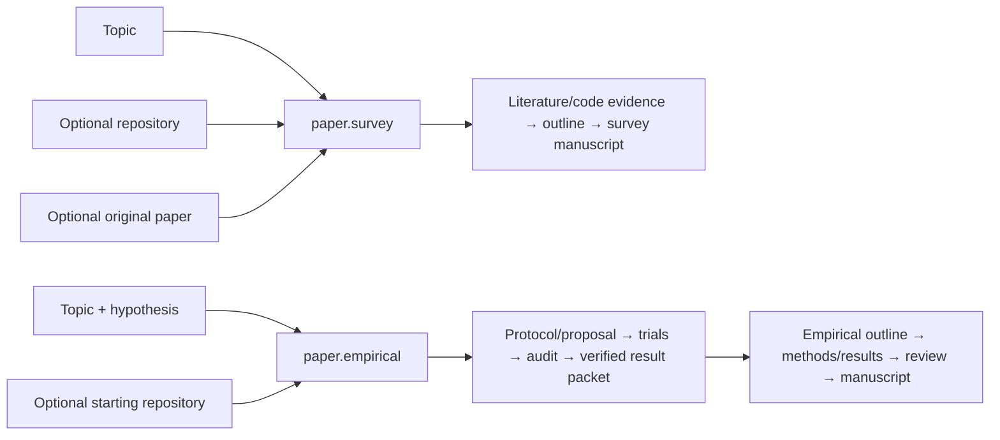

<div align="center">
  <h1>🖌️ MrMaLiang</h1>
  <p><b>An evidence-first workflow for long-form research artifacts.</b></p>
  <h3>The agent decides what to argue. A script decides what counts as evidence.<br>Nothing reaches the manuscript that cannot be traced back to a source.</h3>
  <p>Surveys, repository studies, audited experiment suites, and empirical papers that join those results — from one
  public CLI, <code>maliang</code>. Every scholarly claim resolves to an exact locator in retrieved full text, every
  empirical claim to an audited trial manifest, and every figure and table to the sources it compares. When the
  evidence isn't there, the run stops and says so.</p>
  <p><i>Named after 神笔马良 — Ma Liang and his magic brush, whose drawings became real. Grown up, and now required to
  show his sources.</i></p>
</div>

<p align="center">
  <a href="#-what-is-mrmaliang">What is MrMaLiang</a> |
  <a href="#-why-mrmaliang">Why MrMaLiang</a> |
  <a href="#-what-you-can-build">What You Can Build</a> |
  <a href="#-quick-start">Quick Start</a> |
  <a href="#-flagship-runs">Flagship Runs</a> |
  <a href="#-how-evidence-becomes-a-claim">How Evidence Becomes a Claim</a> |
  <a href="#-what-the-scripts-refuse">What the Scripts Refuse</a> |
  <a href="#-setup">Setup</a> |
  <a href="#-commands">Commands</a> |
  <a href="#-repository-layout">Repository Layout</a> |
  <a href="#-documentation">Documentation</a>
</p>

---

## 📚 What is MrMaLiang

MrMaLiang is **not a writing assistant.** It is the part of a research pipeline that refuses to let an unsupported
claim through.

An LLM can draft a survey in an afternoon. What it cannot do on its own is guarantee that the paper's 200th citation
points at a real paper, that a comparison table's columns reflect what the sources actually measured, or that an
empirical result came from a trial that was really run. MrMaLiang supplies that guarantee — and stops the run when
it can't.

- **Evidence packets, not summaries.** A source becomes citable only after semantic screening, full-text retrieval,
  and a validated packet whose every supporting excerpt is an exact contiguous run of words from the retrieved text.
  A script checks each excerpt against the source before granting the depth.
- **Citation depth is earned.** `A` and `B` sources carry validated packets; `C` is metadata-level context; `D` is
  dropped. Depth is assigned by a script from evidence that exists, never by the model's own assessment.
- **Artifacts must argue something.** There is no figure or table quota. A table is published only when the artifact
  planner selects it, binds it to classified source ids, and states why a reader needs it — and corpus bookkeeping
  dressed as analysis is a major review finding.
- **Empirical claims need an audited manifest.** No experimental number enters a manuscript without a checksummed
  LongExperiment result bundle behind it.
- **Gates fail closed and explain themselves.** Every gate writes a report saying what it measured, what it needed,
  and what to do about it.

One division explains most of the design: **the agent makes the intellectual judgment; a script owns schemas,
provenance, locators, statistics, rendering, and release gates.** That is why gates are code and never prompts.

MrMaLiang coordinates two internal components and runs on an external runtime:

| Component | Owns |
| --- | --- |
| **LongWrite** | Literature and code evidence, outline review, drafting, LaTeX/PDF rendering, review and release gates |
| **LongExperiment** | Controlled study suites, locked inputs, a reviewed executor, trial audits, checksummed manifests |
| **[MalaClaw](https://github.com/gozhiyuan/MalaClaw)** *(external)* | Durable flow state, approvals, retries, quotas, worker execution |

## 🤔 Why MrMaLiang

### It builds on what you already have

| You already have | MrMaLiang adds |
| --- | --- |
| **Claude Code / Codex** | They stay the writers and reviewers, with your subscription and permissions |
| **A literature search** | Multi-provider recall, deduplication, quality scoring, and a citation ledger that survives the run |
| **A prompt saying "cite your sources"** | A validator that checks each excerpt against retrieved full text and refuses the depth when it doesn't match |
| **A LaTeX template** | A renderer owning captions, labels, table layout, and placement, so an agent never hand-writes a "Figure 3" that doesn't exist |
| **A results CSV** | An audited manifest with checksums, trial records, and a verified handoff into the manuscript |

### Compared with the alternatives

| Approach | Great at | Falls short when |
| --- | --- | --- |
| **Asking an LLM for a survey** | A fast, readable overview you'll verify yourself | The bibliography must be real and every claim traceable |
| **Deep-research tools** | Broad synthesis with linked sources | You need exact locators, citation depth, and a release gate that can fail |
| **Reference managers** | Organizing what you already found | Nothing decides what deserves an A-level reading, or checks the draft used it |
| **Notebook + hand-written paper** | Full control | Long runs where the evidence pipeline itself must be auditable |
| **MrMaLiang** | Long research artifacts where being wrong is expensive and provenance is the product | You want a quick draft to edit by hand |

Reach for MrMaLiang when the artifact **runs longer than one sitting**, makes **claims someone will check**, and
would be **expensive to get wrong.**

## 🚀 What You Can Build

Choose the research action. MrMaLiang resolves it into internal declarations and checks them before running anything.

| Public mode | Inputs | What happens |
| --- | --- | --- |
| `paper.survey` | Topic, optional `--repository`, `--discover-repositories`, `--reference-link` | Searches literature, optionally indexes pinned code, writes a source-grounded survey. **Never runs experiments.** |
| `paper.empirical` | Topic, hypothesis, optional repository, optional `--experiment-authoring` | Runs a controlled agentic or prescribed experiment, audits it, then writes from the verified result packet |
| `paper.empirical-import` | An existing audited manifest, optional repository | Runs no experiment; verifies and imports the bundle before writing |

Also available: `writing.novel` and `writing.technical-book` (LongWrite only, no research gates), and `experiment.*`
for an audited suite with no manuscript.

> **Supplying a repository never selects experiment mode.** With `paper.survey` it only changes the evidence profile
> from literature to repository and creates no LongExperiment component. New execution happens only when you
> explicitly choose `paper.empirical`.


```mermaid
flowchart LR
    T["Topic"] --> S["paper.survey"]
    R["Optional repository"] --> S
    P["Optional original paper"] --> S
    S --> W["Literature/code evidence → outline → survey manuscript"]

    H["Topic + hypothesis"] --> E["paper.empirical"]
    C["Optional starting repository"] --> E
    E --> X["Protocol/proposal → trials → audit → verified result packet"]
    X --> M["Empirical outline → methods/results → review → manuscript"]
```

Survey mode may accurately summarize an upstream experiment, but it attributes the finding to that source.
Experiment mode adds LongExperiment before writing and exposes only its verified comparison packet to the outline,
drafting, visual, review, and release stages. Repository code, README prose, screenshots, and runner logs can never
substitute for that packet.

> **When a repository has a paper but no audited manifest** — figures, README result tables, published numbers —
> use `paper.survey`. Cite the original paper for its conclusions and describe them as results reported by its
> authors. Do not select import merely because the upstream publication is empirical.

<details>
<summary><b>The four internal axes</b> — what your choice resolves into</summary>

| Axis | Values | Meaning |
| --- | --- | --- |
| Paper kind | `survey` / `empirical` | Whether the manuscript reports new experimental results |
| Evidence profile | `literature` / `repository` | Whether a pinned existing codebase is central evidence |
| Experiment source | `none` / `run` / `import` | Whether experiment evidence is absent, newly executed, or imported |
| Experiment authoring | `prescribed` / `agentic` | Whether a human supplies the runner, or the LLM proposes a bounded candidate |

Surveys reject experiment options; imports reject authoring options; `run` requires LongExperiment; and `import`
stays blocked until a valid manifest is handed off. Repository empirical initialization binds the same immutable Git
commit into both the experiment and the paper. Inspect any contract with `maliang template show <id>`.

</details>

<details>
<summary><b>Choosing a preset explicitly</b> — empirical variants</summary>

```bash
# The LLM proposes and authors the bounded experiment.
maliang init new-discovery \
  --template paper.empirical \
  --topic "A controlled intervention" \
  --hypothesis "The intervention improves the fixed primary metric."

# A human supplies the protocol/runner in experiment/experiment.yaml.
maliang init prescribed-study \
  --template paper.empirical \
  --experiment-authoring prescribed \
  --topic "Evaluation of a declared protocol" \
  --hypothesis "The declared treatment improves the fixed primary metric."

# A repository pins a starting codebase; the experiment command is unchanged.
maliang init repository-experiment \
  --template paper.empirical \
  --topic "A controlled repository intervention" \
  --hypothesis "The intervention improves the fixed primary metric." \
  --repository https://github.com/example/project.git

# No experiment runs; an existing audited manifest is verified and imported.
maliang init imported-study --template paper.empirical-import \
  --topic "Analysis of an audited result bundle"
maliang handoff import imported-study --manifest /absolute/path/to/experiment-manifest.json
```

The prescribed scaffold intentionally fails preflight until its pinned inputs, primary metric and direction,
baseline and treatment conditions, repeated seeds, trial ceiling, and runner are explicitly configured. The agentic
scaffold supplies a bounded envelope that still requires operator review.

Recognized arXiv, DOI, and OpenReview `--reference-link` values are resolved exactly and inserted as authoritative
recall seeds; a failed exact resolution stops a live run. Other URLs remain unverified scope context. GitHub
discovery is bounded and opt-in: scripts search and filter metadata, the LLM selects candidates, and scripts reject
duplicates before Git pins anything.

</details>

## ⚡ Quick Start

**Requires Node.js 22+ and [MalaClaw](https://github.com/gozhiyuan/MalaClaw) `>=2.0.0 <3.0.0` on `PATH`.**

```bash
git clone https://github.com/gozhiyuan/MrMaLiang.git && cd MrMaLiang
npm install && npm run build
npm link --workspace @mr-maliang/maliang

maliang template list
```

From an unlinked checkout, use `npm run maliang -- …`. LongWrite and LongExperiment are internal component
interfaces — don't install them globally.

### 🧪 The free smoke test

Run this before spending any model quota. It uses the offline `seed` provider and the `dry-run` runtime, so it needs
**no API keys, no LLM, and no GPU** — while exercising the real engine, gates, validators, and artifact contracts.

```bash
maliang init survey-smoke \
  --template paper.survey \
  --topic "Tool use and environment feedback in LLM agents" \
  -- \
  --research-provider seed \
  --target-length-words 1200 \
  --output-format markdown pdf

maliang preflight survey-smoke --runtime dry-run
maliang run survey-smoke --runtime dry-run
maliang writing approve survey-smoke --batch   # the first run pauses at the outline gate
maliang run survey-smoke --runtime dry-run
```

A live run uses the same lifecycle with `--runtime codex` or `--runtime claude-code`.

> **What the rehearsal does not prove.** It validates installation, manifest topology, script contracts, and
> resume/approval mechanics. It does not exercise live-provider recall, open-access retrieval, semantic evidence
> recovery, or the scholarly judgment in an outline review. Don't convert a smoke workspace into a real project.

## 🏁 Flagship Runs

Each flagship has a runbook in [docs/flagships](docs/flagships/) and a versioned blueprint in
[examples/flagships](examples/flagships/).

| Flagship | Start command | Compute |
| --- | --- | --- |
| [Long agentic survey](docs/flagships/long-agentic-survey.md) | `maliang init llm-memory-agentic --blueprint long-agentic-survey` | Codex/Claude; no GPU |
| [Repository survey](docs/flagships/repository-survey.md) | `maliang init repo-study --blueprint repository-survey --repository <git-url>` | Codex/Claude; no GPU |
| [Nanochat agentic empirical paper](docs/flagships/nanochat-agentic-empirical-paper.md) | `maliang init nanochat-agentic-paper --blueprint nanochat-agentic-empirical-paper` | Codex/Claude + reviewed Modal adapter |
| [Self-play autonomous empirical paper](docs/flagships/self-play-autonomous-empirical-paper.md) | `maliang init self-play-agentic-paper --blueprint self-play-autonomous-empirical-paper` | Codex/Claude + reviewed Modal adapter |

```bash
maliang init llm-memory-agentic --blueprint long-agentic-survey
maliang preflight llm-memory-agentic --runtime codex
maliang run llm-memory-agentic --runtime codex
```

The survey blueprint sets a 24,000-word target, a 60-page minimum, 80 woven sources, and author–year citations. It
sets **no figure or table quota** — artifacts are selected because they carry an argument, not to reach a count.
Actual length depends on content and layout; the release report records every gate and whether it was met.

Recommended order: smoke → long survey → repository survey → Nanochat pilot → self-play pilot. The two writing
flagships are validated. The empirical workflows are executable release candidates with complete contracts and
runbooks; **they ship no precomputed scientific results.** Promote a result only after a real run passes every audit
and release gate. The empirical blueprints use generalized Modal remote-job profiles with a workspace-owned locked
`uv` adapter — verify its provider-fake tests, run one bounded GPU smoke, and issue a config-bound lease first, per
[Flagship platform adoption](docs/flagships/platform-adoption.md).

## 🔬 How Evidence Becomes a Claim

The survey pipeline, and where a run can legitimately stop:

```text
recall ──▶ score ──▶ classify ──▶ semantic screen ──▶ full text ──▶ evidence packets
  │          │          │              │                  │              │
  │          │          │              │                  │              └─ exact excerpts, script-checked
  │          │          │              │                  └─ open-access retrieval only
  │          │          │              └─ bounded title/abstract triage
  │          │          └─ A / B / C / D depth from evidence that exists
  │          └─ recency · citations · venue · acceptance
  └─ arXiv · Semantic Scholar · OpenAlex · DBLP · Crossref
                                    │
     corpus gates ◀─────────────────┘        ← stops here when evidence is too thin
          │
          ▼
   gate reachability ──▶ outline ──▶ review ──▶ draft ──▶ quality loop ──▶ release gates ──▶ PDF
          │                                                    │
          │                                                    └─ a stall pivots the frame, not the prose
          └─ names gates already unsatisfiable, before a word is drafted
```

Two properties are worth calling out because they are unusual:

**Reachability is reported before drafting.** Once citation depths are final, a script states which release gates the
corpus can still satisfy. A per-section A-level requirement against a corpus holding zero A-level sources is
unsatisfiable however well the draft is written — far cheaper to learn before 14,000 words than after.

**A stalled loop changes its frame.** When review rounds stop beating the best score, prose and visual revision drop
out of the eligible actions and only frame-changing ones remain: reopen the outline, or expand the evidence. The
decision comes from recorded scores, not from asking the agent whether it is stuck.

## 🛡️ What the Scripts Refuse

The gates are the product. A run that stops because one held is a successful run.

| Gate | Refuses |
| --- | --- |
| **Excerpt validation** | A packet whose supporting excerpt is not an exact contiguous run from the retrieved text |
| **Corpus gates** | Drafting on a corpus below its configured candidate, taxonomy, core-source, recency, or diversity targets |
| **Citation verification** | Runs per section as it is drafted rather than batched at the end, so a systemic problem surfaces while the work to redo is cheap |
| **Evidence audit** | A factual claim with no packet chunk behind it |
| **Artifact relevance** | Pipeline telemetry, source inventories, DOI/venue listings, or packet-status tables presented as analysis |
| **Insight statements** | A figure or table with no stated reason a reader needs it — the renderer may label an artifact, never argue for it |
| **Publication layout** | A file path or raw `[source:...]` marker printed in the manuscript |
| **Release gates** | Bibliography depth, figure and table contracts, length targets, and submission packaging |

Some rules are deliberately not tunable: an A/B source must have locally retrieved full text and exact excerpts,
agents cannot invent citations or experimental results, and the flow keeps failure reports rather than drafting
through a failed gate. Numerical thresholds *are* yours to set — lower one as an explicit scope decision recorded
before the run, never to make an unchanged scope pass. See
[research gates and what is safe to tune](packages/longwrite/docs/configuration.md#research-gates-configurable-targets-and-fixed-evidence-rules).

## 🔧 Setup

<details>
<summary><b>Prerequisites</b></summary>

**Everything:** Node.js 22+, MalaClaw `>=2.0.0 <3.0.0` on `PATH`, Git.

**A real manuscript run:** an authenticated `codex` runtime (recommended — the most exercised configuration, and
what this repository is developed against) or `claude-code`; a LaTeX engine (`tectonic` or `latexmk`); plus
`pdftotext`, Mermaid CLI, or Matplotlib only when a selected feature needs them.

**Agent-authored experiment flagships:** pinned code/model/benchmark inputs, a declared trial budget, a reviewed
Modal adapter, and human approval of the proposal, of generated code before any remote execution, and of full-trial
compute after smoke. Generated candidate code runs **only** through the Modal remote-job adapter — the control plane
validates and materializes a candidate but never executes it locally. Surveys never need Modal; see
[Remote GPU / Modal setup](docs/remote-gpu-modal.md).

</details>

<details>
<summary><b>Credentials</b> — configure only what you select</summary>

Keep writing credentials in `<workspace>/writing/.env` (Git-ignored; start from `.env.example`). A missing optional
key is reported by preflight rather than silently worked around.

| Capability | Required for | Credential |
| --- | --- | --- |
| Codex / Claude Code harness | Any live run | Local CLI login, not `.env` |
| Broad scholarly recall | Deep surveys (recommended) | `OPENALEX_API_KEY`, `SEMANTIC_SCHOLAR_API_KEY` |
| GitHub metadata / private repos | Repository studies | `GITHUB_TOKEN` |
| Embedding retrieval or a direct API worker | Only when enabled in `longwrite.yaml` | `OPENAI_API_KEY` / `ANTHROPIC_API_KEY` / `GEMINI_API_KEY` |
| Nano Banana illustration | Only when explicitly enabled **and** approved | `LONGWRITE_NANOBANANA_API_KEY` or `GEMINI_API_KEY` |
| Remote GPU experiments | The Modal runner, after its adapter smoke test | Modal login — **never** in workspace `.env`, YAML, or Git |

Nano Banana is optional, off by default, and limited to a non-evidentiary orienting illustration. It must never
stand in for a source-grounded diagram, comparison table, metadata plot, or experimental result.

</details>

## 🛠️ Commands

```bash
# lifecycle
maliang template list                          # public contracts
maliang init <workspace> --blueprint <id>      # materialize a flagship configuration
maliang preflight <workspace> --runtime codex  # check every declared capability
maliang run <workspace> --runtime codex        # advance from wherever state left off
maliang run <workspace> --reset                # restart component flow state
maliang status <workspace>
maliang provenance <workspace>

# components
maliang writing --help
maliang experiment --help
maliang writing sync .                         # regenerate the compiled manifest after a config edit
maliang writing validate config .

# the runtime stays separate for flow inspection
malaclaw flow runtimes
malaclaw flow status
```

> ⚠️ **A config edit needs a sync, and a sync needs a fresh run.** `longwrite.yaml` is your configuration;
> `malaclaw.yaml` is the compiled manifest a run executes. Editing the former changes nothing until
> `maliang writing sync .` regenerates the latter — and that changes the workflow hash, which an in-flight run
> cannot adopt without a reset. Decide thresholds before starting, not during.

**Development**

```bash
npm run build                  # build all workspaces
npm test                       # complete suite
npm run release:check          # version coherence + tests + template catalog
```

## 📁 Repository Layout

A workspace has one public parent and fixed component subdirectories:

```text
my-project/
  maliang.yaml                 # template and component lifecycle contract
  writing/                     # writing/paper templates
    longwrite.yaml             # editable configuration — yours
    malaclaw.yaml              # compiled manifest — generated, never hand-edited
    .env                       # local secrets; never commit
    evidence/  sources/  chapters/  paper/  reports/
  experiment/                  # experiment/empirical templates
    experiment.yaml            # runner, pins, trials, suite contract
    results/  reports/
  reports/maliang-preflight.json
```

The monorepo mirrors it:

```text
apps/maliang/                  # public CLI, templates, lifecycle coordinator
packages/longwrite/            # evidence, drafting, rendering, gates
packages/longexperiment/       # study suites, result audit, manifests
packages/research-protocol/    # shared evidence, result, provenance schemas
examples/flagships/            # versioned full-config blueprints
docs/flagships/                # canonical operator runbooks
```

Completed runs are deliberately not committed: PDFs, full text, chunks, SQLite indexes, logs, and model artifacts
are large or sensitive. Keep final outputs with `reports/run-provenance.json`, checksums, and a verified archive.

## 📚 Documentation

- [Quick Start](docs/quickstart.md) · [Template catalog](docs/templates.md) · [Architecture](docs/architecture.md)
- [Flagship runbooks](docs/flagships/README.md) · [Blueprint catalog](examples/flagships/README.md)
- [Configuration reference](packages/longwrite/docs/configuration.md) · [Preflight contract](docs/flagship-preflight.md)
- [Remote GPU / Modal setup](docs/remote-gpu-modal.md) · [Release preparation](docs/release.md)

## 🔗 Related Projects

Architecture informed by, but not claiming to reproduce:

- [MalaClaw](https://github.com/gozhiyuan/MalaClaw) — the durable agent-workflow runtime underneath
- [Deli AutoResearch / AutoResearch V2](https://victorchen96.github.io/auto_research/framework.html) — long-horizon
  autonomous research reference
- [AutoScientists](https://github.com/mims-harvard/AutoScientists) — external autonomous-science runner integration
- [Nanochat](https://github.com/karpathy/nanochat.git) — pinned ablation benchmark
- [ProteinGym](https://github.com/OATML-Markslab/ProteinGym) — public protein-fitness benchmark

## 📄 License

[MIT](LICENSE)
