# Full AutoResearch Agentic Flagship Guide

The matching versioned starting point is the
[long-agentic-survey blueprint](../../examples/flagships/long-agentic-survey/).

This is the manual-operator path for a release-quality research survey. It
uses LongWrite's default `auto_research_agentic` mode and MalaClaw's resumable
flow engine. Use a fresh workspace and inspect its review/action records.

The mode retains the full evidence and release skeleton inspired by the
*publicly documented* [AutoResearch V2](https://victorchen96.github.io/auto_research/framework.html)
workflow shape: broad retrieval, citation-network expansion, full-text evidence,
section evidence packets, claim review, publication figures/tables, LaTeX/PDF
build, and strict release validation. It does not claim to reproduce an
unpublished or private implementation.

This guide starts from a new machine. By the end, you will have a local
research workspace, an optional dashboard for monitoring it, a manually
approved outline, and a resumable agent run that produces inspectable sources,
chapters, reviews, LaTeX, a PDF, and validation reports.

## Mode contract

| Axis | Value |
| --- | --- |
| Paper kind | `survey` |
| Evidence profile | `literature` |
| Experiment source | `none` |
| Experiment authoring | Not applicable |

`maliang init --blueprint long-agentic-survey` records these values in the
parent `maliang.yaml`, creates only `writing/`, and rejects experiment handoff
state for this project. The existing LongWrite evidence, drafting, review, and
release scripts remain the implementation for this combination; adding the
orthogonal axes does not fork or duplicate the survey pipeline.

## Workflow at a glance

This is LongWrite's implementation, not a diagram of AutoResearch V2's private
internals. The original workflow's public materials describe its goals and
shape, but do not disclose whether its control system is deterministic, an LLM
loop, or a hybrid. LongWrite uses deterministic orchestration around selected
LLM stages. The current agentic mode first lets an LLM choose a bounded,
source-grounded analytical-artifact strategy, then lets it choose from a
declared remediation catalogue so that every transition and artifact remains
inspectable.

```mermaid
flowchart TB
  topic["Topic and taxonomy"] --> intake["[LLM · research-lead]<br/>Intake: project brief"]
  references["Optional user references<br/>URLs and workspace files<br/>brief context only—not fetched or cited"] -.-> intake
  intake --> planner["[LLM · source-curator]<br/>Search planner: bounded query variants"]
  repositories["Optional configured Git/local repositories<br/>pinned codebase evidence"] --> codebase["[script] Git snapshot + bounded code evidence"]
  planner --> codebase

  subgraph evidence["1. Deterministic research and evidence DAG"]
    direction LR
    recall["[script] Provider recall"] --> expansion["[script] Citation expansion<br/>(Semantic Scholar key optional)"]
    expansion --> corpus["[script] Metadata fusion, dedupe,<br/>scoring"]
    corpus --> abstractscreen["[LLM] Bounded title/abstract semantic screen"]
    abstractscreen --> fulltext["[script] Approved full-text retrieval"]
    fulltext --> backend{"Evidence retrieval backend"}
    backend --> fts["[script] SQLite FTS<br/>(default, local, keyless)"]
    backend -. "optional key + config" .-> hybrid["[script] Hybrid embeddings"]
    subgraph refresh["Targeted refresh action used by the quality loop"]
      direction LR
      targetedplan["[script] Targeted query plan<br/>from the selected action plan"]
      refreshrecall["[script] Recall, enrich,<br/>score, classify"]
      refreshscreen["[LLM + scripts] Re-screen abstracts,<br/>refresh full text and source packets"]
      refreshevidence["[script] Finalize A/B depth,<br/>corpus gates, section packets"]
      targetedplan --> refreshrecall --> refreshscreen --> refreshevidence
    end
  end

  planner --> recall
  codebase --> outline
  fts --> sourceevidence["[LLM] Source evidence packets<br/>exact local excerpts"]
  hybrid --> sourceevidence
  sourceevidence --> depth["[script] Finalize A/B depth"]
  depth --> gates["[script] Corpus assessment"]
  gates --> recovery{"Core evidence gate passes?"}
  recovery -- "no · max 2 rounds" --> recoverplan["[LLM + scripts] Bounded targeted recovery:<br/>expand → re-screen → full text → packets"]
  recoverplan --> gates
  recovery -- yes --> hardgate["[script] Final hard corpus gate"]
  hardgate --> outline["[LLM · outline-architect]<br/>Evidence-aware outline"]
  outline --> outlineaudit["[script] Survey + structure audits"]
  outlineaudit --> outlinecritique["[LLM · skeptical-reviewer]<br/>Outline critique from source packets"]
  outlinecritique --> outlinerevise["[LLM · outline-architect]<br/>Outline revision"]
  outlinerevise --> outlineaudit
  outlineaudit --> approval{{"Script-owned outline readiness gate<br/>optional human approval"}}
  approval --> predraftartifact["[LLM · analyst] Pre-draft artifact plan<br/>formalization / matrix / timeline / diagram"]
  predraftartifact --> predraftcheck["[script] Validate source, section,<br/>taxonomy, and empirical eligibility"]
  predraftcheck --> drafting["[LLM · chapter-writer] Draft sections<br/>foreach approved section; max 2 parallel"]
  drafting --> ledger["[script] Evidence ledger and audit"]
  ledger --> initialbuild["[script] Figures, tables, TeX, initial build"]
  initialbuild --> baseline["[LLM · skeptical-reviewer]<br/>Baseline review"]

  subgraph quality["2. Bounded adaptive quality loop (at most 5 rounds)"]
    direction LR
    artifactplan["[LLM · analyst]<br/>Choose artifact strategy:<br/>formalization / matrix / metadata plot / timeline"]
    artifactrepair["[script] Validate source, section,<br/>taxonomy, and empirical eligibility"]
    actionplan["[LLM · analyst]<br/>Write strict action plan<br/>from validated strategy"]
    repair["[script] Validate action-plan contract"]
    dispatch["[MalaClaw] Allowlisted dispatcher"]
    artifactplan --> artifactrepair --> actionplan --> repair --> dispatch
    dispatch --> revise["[LLM · editor]<br/>Revise sections"]
    dispatch --> reopen["[LLM · outline-architect]<br/>Reopen outline for a structural defect"]
    dispatch --> visual["[LLM · artifact-builder]<br/>Revise visual plan"]
    dispatch --> ask{{"Operator clarification<br/>(only action)"}}
    revise --> audit["[script] Citation audit"]
    reopen --> audit
    visual --> audit
    ask --> audit
    audit --> judge["[LLM · skeptical-reviewer]<br/>Double claim judgment"]
    judge --> rebuild["[script] Rebuild"]
    rebuild --> review["[LLM · skeptical-reviewer]<br/>Review rebuilt manuscript"]
    review --> stop{"[script] Deterministic score and stop test"}
    stop -->|"continue"| artifactplan
  end

  baseline --> artifactplan
  dispatch -->|"selected evidence expansion"| targetedplan
  refreshevidence --> audit
  stop -->|"review score >= 8.0"| verify["[script] URL verification and final release validation"]
```



### What the default workflow decides

`maliang init` records the user-supplied topic, taxonomy, audience, and
limits in `longwrite.yaml` and `project_brief.md`; it makes no model or provider
call. The LLM then writes a bounded `sources/search-plan.json`, while scripts
execute recall, deduplication, metadata LQS, venue upgrades, and corpus gates.
The live semantic screen reads only a script-bounded title/abstract set. Full
text is retrieved only for approved candidates; exact excerpts in source packets
are verified before a source can receive final A/B citation depth.

The LLM decides the outline, pre-draft analytical artifact plan, prose, and
review findings. Scripts own provider normalization, provenance, corpus gates,
indexing, citation checks, source-ID validation, CSV/SVG/TeX/PDF assembly, and
release validation. Agentic therefore means evidence-aware intellectual choices
inside a declared and inspectable execution contract—not arbitrary execution.

### What users can configure

Provider, budget, breadth, citation/visual gates, paper kind, presentation,
approvals, and runtime choices live in `longwrite.yaml`. Edit it, then run
`maliang writing sync <workspace>` and `maliang writing validate config <workspace>`. A
different loop topology, tool catalog, or trust boundary requires a deliberately
new mode/workflow and validation; a normal stage override cannot turn a trusted
script into arbitrary LLM execution.

For a public paper version, `publication.presentation.disclosure.provenance`
can add a compact front-matter note naming LongWrite, MalaClaw, and the actual
per-unit runtime/model assignments recorded in flow state. Keep it disabled for
anonymous submission workflows; an unpinned harness default remains explicitly
unresolved rather than being reported as a model name.

### Initial research and evidence DAG

The path from provider recall through the initial manuscript build is a DAG:
each script stage writes inspectable artifacts for the next one. It retrieves
and normalizes sources, expands citations, applies quality and coverage gates,
retrieves accessible full text, and creates either local SQLite FTS (default) or
the optional hybrid embedding index. These artifacts become the bounded evidence
packets used by the LLM stages; the model does not treat the web as its source
of truth.

The dashed **Optional user references** input has two explicit paths. An arXiv,
DOI, or OpenReview link is parsed as an authoritative scholarly seed, resolved
exactly through the provider API, merged into recall, and then subjected to the
same scoring, full-text, evidence-packet, and citation gates as every other
source. A recognized link that cannot resolve stops a live run. Other URLs and
local files remain scope/terminology/style context; they do not become citable
evidence merely because they appear in the brief.

### Optional GitHub/local codebase input

`research.codebases` is the deliberate route when a repository itself should
be a source. Unlike a free-form reference link, it is snapped with Git after
the search plan, pinned to a resolved commit, and supplied as bounded code/doc
evidence to the outline and writers. It produces an `@software` reference and
supports `[codebase:<id>:path#Lx-Ly]` markers. It never counts as scholarly
literature and it is never executed by LongWrite. No GitHub API is required
for this path; Git clone plus the pinned commit is the reproducibility
contract. An empirical paper may later pass the same pinned repository to
LongExperiment, where execution/results have a separate controlled contract.

When `research.codebase_discovery.enabled: true`, the flow inserts an optional
bounded discovery branch before that Git snapshot: script-owned GitHub API
search from the approved search plan → deterministic fork/archive/license/
language filtering and limited README retrieval → LLM relevance screening →
script validation of selected candidates. `GITHUB_TOKEN`/`GH_TOKEN` is optional
but recommended for rate limits. Stars and forks are never scholarly-quality
signals, and a selected repository still needs Git-pinned evidence before it
can be cited.

The public equivalent is `maliang init ... --discover-repositories`, with
bounded `--repository-query-budget`, `--repository-max-candidates`,
`--repository-max-readmes`, `--repository-max-selected`, and optional
`--repository-language` controls. Explicit and discovered sources are
canonicalized before snapshotting, so URL spelling or `.git` differences cannot
admit the same repository twice. Context allocation is round-robin across
pinned repositories rather than first-repository-wins.

### Outline review gate and first manuscript

In the live agentic workflow, the LLM creates an evidence-aware outline from
the compact source packets—not a blind reading of every cached paper. A bounded
two-round loop then runs: script survey/structure audits, LLM critique grounded
in named source packets, script-owned `outline_readiness`, and LLM revision.
The default flow automatically continues when the final re-audit passes; set
`research.outline_review.approval_mode: human` when an operator must approve it.
Immediately after readiness, an LLM creates `reviews/artifact-plan.json` and a
script validates its source IDs, target section, taxonomy cells, and empirical
eligibility. This pre-draft plan can choose a compact, evidence-backed
formalization, comparison matrix, metadata plot, timeline, or architecture
diagram. It cannot write TeX, coordinates, plot values, or experiment results.
The visual planner converts compatible choices into the source-bound declarative
figure-spec contract; the chapter writer sees only intents for its own section.
After that, `draft_sections` is a finite `foreach`: one section per approved
outline entry, with at most two sections in parallel. This matches the local
Codex and Claude Code worker caps, so the engine does not queue extra costly
section writers behind an optimistic dashboard setting. In the full mode,
the default `llm_sections` strategy sends every section and its bounded evidence
packet to the authenticated harness for direct drafting. Scripts remain
responsible for repeatable work: evidence allocation and ledgers, figures,
tables, TeX/PDF assembly, and validation. `scaffold_then_revise` is the
explicit lower-cost option: it creates citation-marked scaffolds locally and
relies on later LLM revision.

### Paper structure and submission targets

The research-paper build uses article front matter: title, authors, and a
150--250-word LLM-written abstract, followed directly by the approved outline
sections and bibliography. It deliberately omits a book-style table of contents.
For this survey, ask the outline agent for a conventional structure such as
**Introduction**, **scope and method**, **taxonomy**, **method-family synthesis**,
**evaluation**, **safety/limitations**, and **conclusion**.

At the outline approval gate, you can request a different body structure with:

```bash
maliang writing outline revise llm-memory-agentic \
  --message "Use an arXiv-style survey structure: Introduction; Scope and review method; Taxonomy; Memory architectures; Planning; Tools and feedback; Evaluation; Safety and limitations; Conclusion. Keep the article abstract and do not add a table of contents."
```

That command rewrites the outline and downstream manuscript work while retaining
the completed research corpus. It changes body structure; it is not a publisher
template switch. Reference links and files are context leads, not parsed paper
templates. The final packaging step now supports the generic `arxiv` target and
a workspace-local `custom` target. For a named venue, copy its official
`.cls`/`.sty`/`.bst` assets into the workspace, set its anonymity, page limit,
and required sections in `publication`, then validate and package its source
bundle. arXiv itself accepts a clean TeX source bundle rather than imposing one
scholarly paper structure; it automatically compiles the source and requires the
submitter to inspect the resulting PDF.

### Quality loop and evidence feedback

The initial build receives a scored baseline review. The deep profile then
bounds the adaptive loop to five rounds. In every below-target round, the
artifact planner reads the latest review, score, evidence audit, claim gate,
and operator feedback, then writes `reviews/artifact-plan.json`. It may select
only a source-grounded formalization, comparison matrix, verified-metadata
plot, taxonomy recall, or an empirical pilot for an empirical paper. A script
validates its source IDs, section, taxonomy cell, and empirical eligibility.
The action planner then writes `reviews/action-plan.json` to route the
validated strategy; the next script rejects unknown tools, missing finding IDs,
over-budget plans, and a clarification mixed with another action.

The dispatcher may materialize the smallest sufficient set of three actions:
section revision, a structural `reopen_outline`, visual-plan revision, or targeted evidence expansion. An
evidence expansion first reruns bounded recall, enrichment, scoring, and
classification. The enclosing quality loop then re-screens the bounded
title/abstract set, ingests approved full text, refreshes exact-excerpt source
packets, finalizes A/B depth, reruns corpus gates, and reallocates section
evidence. This makes a writing-time review finding repairable without allowing
newly recalled sources to bypass semantic or full-text evidence checks. It is
still a targeted refresh, not a complete replay of the initial DAG: broad
snowball recall and identity reconciliation do not automatically rerun every
round. A request to re-baseline the corpus is an explicit new research pass,
not a hidden revision action.

`reopen_outline` is reserved for a major/critical structural, scope, or
taxonomy defect that incremental chapter edits cannot repair. It gives the
outline architect the current source packets and requires a rewritten
`outline.md`/`outline.json`; scripts then rerun the survey and structure audits
before reallocating section evidence. The next independent manuscript review
checks that the reopened structure actually resolved the triggering weakness.
New agentic workspaces use `research.outline_review.approval_mode: auto`, so a
passing deterministic readiness gate continues without repeated pauses. Set it
to `human` when every initial or reopened outline should queue operator
approval.

If the planner needs a human decision, it may select only
`request_operator_clarification`. That action writes
`reviews/clarification-request.md`, pauses the flow, and requires an answer in
`feedback/user-feedback.md` before approval and resumption. The loop stops when
`review_score >= 8.0`; it fails on its hard limit or a sustained plateau rather
than spending indefinitely.

### Execution semantics and configuration

MalaClaw deterministically controls stage order, persisted state, validators,
retries, approvals, and loop termination. Nodes marked `[LLM]` use the
authenticated runtime selected at launch (`codex` or `claude-code`) and are
non-deterministic; `[script]` nodes run local LongWrite commands. One runtime is
used by default. `runtime_profile: codex_first` optionally assigns Claude Code
to selected planning/review stages and Codex to execution stages; it remains one
MalaClaw flow, not independent Codex and Claude goal loops.

The `longwrite.yaml` created by `maliang init` is the editable source of
truth. After changing it, run `maliang writing sync <workspace>` and
`maliang writing validate config <workspace>`.

### Owner personas are prompt roles, not orchestrators

The owner shown after `LLM ·` in the diagram selects `roles/<owner>.md` as
prompt guidance. It does not select a model, create a separate agent loop, or
grant tools. The same owner can be used by several LLM stages:

| Owner | LLM-owned work in this full mode | Script-owned work with the same accountability label |
| --- | --- | --- |
| `research-lead` | Intake | — |
| `source-curator` | Search planning | Recall, citation expansion, enrichment, full-text, evidence allocation |
| `outline-architect` | Outline | — |
| `artifact-builder` | Visual placement plan | Figure/table and TeX/PDF build, final validation |
| `skeptical-reviewer` | Review and double claim judgment | — |
| `editor` | Revision | — |
| `chapter-writer` | Direct section drafting with `writing_strategy: llm_sections` | This is the default; `scaffold_then_revise` is the explicit low-cost/test script alternative. |
| `analyst` | Artifact strategy and adaptive action planning | Scoring, classification, corpus gates, artifact/action-plan repair, citation/evidence audits |

Codex and Claude Code are worker **runtimes**, not named owner personas. They
receive the owner-specific prompt only when executing an LLM-owned unit. There
is no separate Codex/Claude supervisor persona and no dependency on either
product's internal goal/loop feature. MalaClaw itself provides the persisted
orchestration, approvals, retries, and bounded `quality_loop` shown in the
diagram.

### Runtime and model selection

The default full-mode manifest selects the **`codex` runtime**, but deliberately
does not pin a Codex model ID. Each `[LLM]` stage therefore runs `codex exec`
and inherits the model and reasoning settings from the authenticated Codex
CLI's own configuration/account. This is why a newly created workspace and the
dashboard can show `runtime: codex` but no model name. Check the active local
selection with:

```bash
rg -n '^\s*model\s*=|^\s*model_reasoning_effort\s*=' ~/.codex/config.toml
```

If this prints `model = "gpt-5.6-terra"` and high reasoning, the default Codex
stages in this workspace will use Terra at high reasoning. On a different
machine, inspect its own Codex configuration rather than assuming it uses the
same model.

The default LLM-owned units are `intake`, `search_planner`, `outline`,
`draft_sections.draft`, `abstract`, and `visual_plan`, plus `baseline_review`,
`quality_loop.action_plan`, `quality_loop.review`, and
`quality_loop.claim_judge`. With a live provider and
`research.semantic_screen.enabled: true`, the initial pass additionally runs
`semantic_screen` (bounded title/abstract triage) and `source_evidence_extract`
(claim extraction from approved local full text). When
`research.outline_review.enabled: true`, it also runs `outline_review` and
`outline_revise` before the readiness gate. The dispatcher materializes
an LLM revision or visual-plan unit only when that declared action is selected.
Retrieval, metadata LQS, candidate selection, full-text download, excerpt
verification, final citation-depth gating, evidence indexing, citation/evidence
audits, validation, and builds are locked local `script` units and never
consume a Codex or Claude model.

`visual_plan` is the deliberate boundary between those two classes of work.
The LLM chooses source-grounded figure specifications—conceptual-map labels and
relationships, timeline source selections, and comparison-table cells, captions,
insights, and placement. The local builder validates source IDs, derives
timeline dates from classified metadata, renders the CSV/SVG/TeX artifacts,
assigns stable labels, wraps long tables, and checks generated LaTeX for
shrunken tables or hand-numbered references.
More model retries cannot reliably repair a missing renderer or invalid PDF
layout; those are deterministic artifact contracts, while the explanatory
argument remains LLM-authored.

| Goal | Supported configuration | Important boundary |
| --- | --- | --- |
| Keep one Codex model for all Codex stages | Set `model` and `model_reasoning_effort` in the user's Codex configuration. | This is a personal machine default, not a workspace setting. |
| Pin a Codex model for one workspace stage | Add `execution.stage_overrides.<stage>.model` in `longwrite.yaml`; LongWrite compiles it to `codex exec -m <model>`. | Keep the runtime unset to retain `codex`. Script stages reject model overrides. |
| Use Claude Code for selected judgment stages | Choose the bundled `codex_first` or `claude_first` runtime profile, or set a stage's `runtime: claude-code` and a model accepted by that CLI/account. | Requires Claude Code authentication; it is not enabled by the default profile. |
| Use a direct API model | Set both `runtime: openai-api` (or another API runtime) and `model`. | API runtimes can produce only one concrete output, so use them only for compatible units such as `search_planner`, `visual_plan`, or `quality_loop.claim_judge`, never multi-file outline/revision stages. |

Runtime **profiles** are presets for this execution mapping; they do not change
the topic, provider, taxonomy, research budgets, quality-loop shape, or any
locked script stage:

| Profile | Full-mode LLM setup | Use for this demo? |
| --- | --- | --- |
| `default` | Every LLM-owned stage uses the runtime chosen at launch (`codex` here) and its Codex CLI model setting (Terra/high on this machine). | Yes. This is the recommended first flagship configuration. |
| `codex_first` | Codex remains primary. Its bundled advisor/reviewer tiers route `intake` and `outline` to Claude Code's advisor tier, `review` to its reviewer tier, and `revise` to the advisor tier; unassigned LLM stages remain on Codex. | Only after Claude Code is authenticated and you intentionally want a mixed-provider comparison. |
| `claude_first` | Claude Code becomes primary for all non-script LLM stages, with its advisor/reviewer tier assignments for planning and review. | Not for the baseline Codex/Terra run. Use only when you want Claude Code to own the LLM work. |

Profiles change execution/model routing only; the deterministic research and
release pipeline remains the same. Other available worker runtimes are shown
by `malaclaw flow runtimes`: `dry-run`, `script`, `codex`, `claude-code`,
`openai-api`/`openai-compatible`, `anthropic-api`, `gemini-api`, and `ollama`.
They are runtime implementations, not profiles. The direct API/local options
are useful for compatible single-output tasks, while Codex and Claude Code are
the full-mode harness choices for multi-file LLM work.

`claude_advisor_sonnet` remains accepted as a backward-compatible legacy alias;
use `claude_first` in new commands and workspaces.

For example, this keeps the full workflow on Codex/Terra except for a stronger
outline, while using Terra explicitly for review and revision:

```yaml
execution:
  stage_overrides:
    outline:
      model: gpt-5.6-sol
    quality_loop.review:
      model: gpt-5.6-terra
    quality_loop.revise:
      model: gpt-5.6-terra
```

After any override, run `maliang writing sync <workspace>` and `maliang writing
validate config <workspace>`. In the current dashboard, the stage override controls
operate on top-level standard stages. Use `longwrite.yaml` for loop children
such as `quality_loop.review` and `quality_loop.revise`; the dashboard's
**Save config** does not replace those explicit YAML paths.

## 1. Install and authenticate

Install Node.js 22 or newer, MalaClaw, and LongWrite. The source-checkout path
is the alpha-supported installation route.

### Node.js prerequisite

Install Node.js 22 or newer using your preferred system package manager or
version manager. On Apple Silicon macOS with Homebrew, use the following once;
it makes Node 22 the default in both ordinary interactive terminals and the
login shells used by dashboard/automation launchers:

```bash
brew install node@22
printf '\n# MalaClaw and LongWrite require Node 22+\nexport PATH="/opt/homebrew/opt/node@22/bin:$PATH"\n' >> ~/.zprofile
printf '\n# MalaClaw and LongWrite require Node 22+\nexport PATH="/opt/homebrew/opt/node@22/bin:$PATH"\n' >> ~/.zshrc
exec zsh -l
```

If you use an Intel Mac, replace `/opt/homebrew` with the value printed by
`brew --prefix node@22` before `/bin`. Avoid adding several competing
`node`, `node@20`, or version-manager paths after this line: the first `node`
on `PATH` wins. Verify the selected binary before installing either project:

```bash
node --version  # must print v22.x or newer
npm --version
```

LongWrite records the active Node binary in the generated script-stage
commands so the workflow remains reproducible. If you initialized an existing
workspace while Node 20 or older was active, switch to Node 22+ and repair its
derived manifest before resuming—do not reinitialize the workspace:

```bash
maliang writing sync llm-memory-agentic
(cd llm-memory-agentic/writing && malaclaw flow migrate)
maliang writing retry llm-memory-agentic  # only when the flow has a failed stage
```

`migrate` adopts the additive generated-command change while preserving
completed work. New `init` and `sync` commands now fail immediately when Node
22+ is not active, rather than allowing a later SQLite evidence-index failure.

With Node.js 22+ active, install the source checkouts:

```bash
git clone https://github.com/gozhiyuan/MalaClaw.git
cd MalaClaw
npm install
npm run build
(cd dashboard && npm install && npm run build)
npm link

cd ..
git clone https://github.com/gozhiyuan/MrMaLiang.git
cd MrMaLiang
npm install
npm run build
npm link --workspace @mr-maliang/longwrite
```

For a real flagship, authenticate **one** primary harness runtime:

- `codex`: install the Codex CLI, then complete its normal `codex login` flow.
- `claude-code`: install Claude Code, then complete one interactive `claude`
  login/session.

You do not need both subscriptions. The default profile uses the runtime you
pass to `maliang run` or `malaclaw flow supervise`. The `codex_first` profile
is an optional hybrid: Claude plans/reviews and Codex executes bulk work, so it
requires both harnesses and can request an advisor-budget approval.

Run availability checks before creating a project. They do not spend model
quota:

```bash
malaclaw flow runtimes
malaclaw flow runtimes --runtime codex
# or
malaclaw flow runtimes --runtime claude-code
```

Your exact list varies with the tools and API keys installed on the machine. For
example, a Codex-ready machine reports output shaped like:

```text
# Worker runtimes

- codex: available
  headless: yes
  max_concurrent: 2
  isolated_workspace: no
  capabilities: single_output, multi_file_edit, declared_command_tool, provider_tool_calling, cli_harness_tools
  detail: codex-cli <version>
```

`available` means MalaClaw can invoke the runtime's local executable (or reach
the configured API endpoint). It is a preflight probe, not a model-quota test;
complete `codex login` or `claude` login first. `headless: yes` means the flow
can run stages unattended. `max_concurrent` is the runtime's local concurrency
limit, and `isolated_workspace: no` means it does not require a separate
isolated workspace. The listed capabilities describe the kinds of stage work
the runtime can perform.

It is normal for API-based runtimes to report `unavailable` when their API-key
environment variables are unset. They are optional for this guide: when using
Codex, the gate to pass is `malaclaw flow runtimes --runtime codex` reporting
`codex: available`; do not add unrelated provider keys merely to make the full
list green.

### Keys and credentials

| Capability | Needed? | Credential | Why |
| --- | --- | --- | --- |
| Codex or Claude Code stages | Choose one | Harness login/subscription | Required for multi-file planning, review, and revision in a real run. |
| arXiv, DBLP, Crossref | No | None | Keyless sources used by `research.provider: multi`; each still applies public-service throttling or rate limits. |
| OpenAlex | Recommended for deep runs, not required | `OPENALEX_API_KEY` | Basic Works searches can run keylessly, but the free key provides a much larger daily API allowance. |
| Semantic Scholar | Recommended, not required | `SEMANTIC_SCHOLAR_API_KEY` | Improves authenticated rate limits and citation-network expansion; keyless requests remain subject to service limits. |
| SQLite FTS evidence retrieval | No | None | Default local evidence index; no vector database or embedding API. |
| Hybrid embedding retrieval | Optional | `MALACLAW_OPENAI_API_KEY` or `OPENAI_API_KEY` | Needed only for `research.retrieval.backend: hybrid_openai`. |
| Direct API worker stages | Optional | `MALACLAW_OPENAI_API_KEY`/`OPENAI_API_KEY`, `MALACLAW_ANTHROPIC_API_KEY`/`ANTHROPIC_API_KEY`, or `MALACLAW_GEMINI_API_KEY`/`GEMINI_API_KEY` | Available for compatible single-output stages, not recommended as the primary full-paper harness. |
| Nano Banana conceptual figure | Optional | `LONGWRITE_NANOBANANA_API_KEY`, `GEMINI_API_KEY`, or `GOOGLE_API_KEY` | Explicitly approved conceptual diagrams only; never evidence. |

### Provider-aware polite querying

“Keyless” means a credential is not required; it never means unlimited. The
recall client schedules query variants serially and independently paces each
provider: arXiv at least 3 seconds between requests, DBLP 2 seconds, and
Semantic Scholar, OpenAlex, and Crossref 1 second. A `429` or `503` response is
retried up to twice, honoring `Retry-After` when supplied; Crossref's advertised
rate-limit headers can only make its pace more conservative.

This prevents avoidable burst traffic. It cannot reserve a provider's shared or
daily quota, guarantee that a public API is available, or turn an anonymous
OpenAlex allowance into a deep-run allowance. `multi` therefore remains
fault-tolerant: it keeps results from healthy providers when one is limited.
The trade-off is intentional: a 50-query deep recall has an arXiv pacing floor
of roughly 2.5 minutes before network latency, retries, enrichment, and
full-text work.

### Optional Semantic Scholar enrichment

Semantic Scholar is a scholarly metadata and citation-graph API. LongWrite can
search it without a key, but a manual flagship benefits from an authenticated
key during broad recall and forward/backward citation expansion. The key is not
an LLM credential and does not pay for model usage; it identifies this client
to Semantic Scholar's API. Request it through Semantic Scholar's
[API page](https://www.semanticscholar.org/product/api), which emails the
private key after the request is approved.

If you have one, put it in the workspace-local `.env` described below (or
export it in the shell that starts the supervisor):

```bash
export SEMANTIC_SCHOLAR_API_KEY="..."
```

Without it, the keyless providers still run and Semantic Scholar requests are
made unauthenticated; provider rate limiting or temporary failures can reduce
recall. The multi-provider path tolerates an individual provider failure as
long as another provider returns results. The API key is therefore recommended
for a flagship, not a prerequisite for starting one.

### Recommended OpenAlex capacity

OpenAlex is an open scholarly catalog of works, authors, venues,
institutions, topics, and their relationships. LongWrite uses its **Works**
search endpoint for metadata, identifiers, citation counts, and available
open-access links; it is not a page reader or a source of automatically trusted
claims. Basic API requests can run without a key, but the current free API
allowance is much smaller. For the 400-candidate / 50-query deep demo, create a
free [OpenAlex account](https://openalex.org/settings/api), copy the key from
its API settings, then put it in the workspace-local `.env` described below
(or export it in the shell that starts the run):

```bash
export OPENALEX_API_KEY="..."
```

LongWrite appends it as the API's `api_key` request parameter and never writes
the secret into the workspace. Without it, `multi` continues with the smaller
OpenAlex allowance and tolerates an OpenAlex failure when other providers
return sources.

Do not put any credential in `longwrite.yaml`, `malaclaw.yaml`, examples, or
git. For the direct API-worker environment variables and capability limits, see
MalaClaw's [workflow runtime reference](https://github.com/gozhiyuan/MalaClaw/blob/main/docs/workflow-runtime.md).

### Workspace-local secrets: `.env`

Each newly initialized workspace contains a non-secret `.env.example` and a
`.gitignore` entry for `.env`. Copy the template once, then fill only the keys
for capabilities you selected:

```bash
cd llm-memory-agentic
cp .env.example .env
```

For this deep demo, the relevant part is:

```dotenv
OPENALEX_API_KEY="..."          # recommended for the 50-query deep profile
SEMANTIC_SCHOLAR_API_KEY="..."  # recommended, not required
```

`maliang run <workspace>` and the dashboard's **Run** action load that
workspace's `.env` before starting MalaClaw, so its script and worker child
processes inherit the keys. A shell export wins over the `.env` value, which is
useful for a one-off override. The loader supports only literal `KEY=value`
lines; it never executes shell fragments or writes a secret into YAML or flow
state. Existing workspaces gain the template safely on the next
`maliang writing env init <workspace>` (without regenerating their flow manifest).

### Pre-run capability choices

Choose these before launching a costly run. The default full mode is usable
without extra research API keys or system tools; optional capabilities either
auto-detect a local program or require an explicit `longwrite.yaml` and
environment-variable change. Missing capabilities are reported rather than
silently substituted.

#### Minimum setup for this guide's flagship run

Before creating and running the workspace, complete the earlier Node.js 22+
install, link both CLIs, and confirm one authenticated harness runtime with
`malaclaw flow runtimes --runtime codex` (or `claude-code`). For the guide's
default `markdown pdf` output and strong open-access evidence coverage, choose
the minimum Homebrew path is:

```bash
brew install tectonic poppler
```

`tectonic` is the minimum additional local tool for the promised real PDF.
`poppler` is strongly recommended because it provides `pdftotext` for
open-access PDFs that do not have readable HTML. A full release also requires
the Matplotlib setup below: the source-year corpus plot is a placed publication
artifact and is no longer silently omitted. You do **not** need a Semantic
Scholar key or Mermaid CLI merely to start the run.

#### What works immediately

| Capability | Default state | What the flow does without further setup |
| --- | --- | --- |
| Literature recall | On | Queries arXiv, OpenAlex, DBLP, Crossref, and Semantic Scholar's public endpoint; individual provider failures are tolerated when another provider returns sources. An OpenAlex key is recommended for the deep profile's request volume. |
| Evidence retrieval | On | Builds a local SQLite FTS index. No embedding API, vector database, or key is required. |
| Full-text acquisition | On where accessible | Tries arXiv HTML, ar5iv HTML, and supplied open-access PDF links. HTML text works immediately. |
| Manuscript build | On | Writes TeX and a PDF artifact. Until a LaTeX engine is available, that PDF is a placeholder and `reports/latex-build.md` says no real PDF was compiled. |
| Figures | Matplotlib required for release | Every research release places a Matplotlib PNG corpus plot in the paper; preflight checks its renderer. Mermaid source is always written; its rendered SVG is optional. |

#### Recommended local tools

`npm install` installs neither Tectonic nor Poppler. The selected Conda or
Homebrew path above enables a real compiled PDF and lets LongWrite extract
readable text from open-access PDFs through `pdftotext`. Without these tools,
the flow remains inspectable but keeps a placeholder PDF and skips unreadable
PDF text.

For the full release's required Python-rendered corpus plot, use `uv` rather
than modifying a system Python:

```bash
brew install uv
uv venv ~/.longwrite-figure-tools
uv pip install --python ~/.longwrite-figure-tools/bin/python matplotlib
export LONGWRITE_PYTHON_BIN="$HOME/.longwrite-figure-tools/bin/python"
```

Persist that Python selection for future `zsh` terminals before starting later
LongWrite runs:

```bash
printf '\nexport LONGWRITE_PYTHON_BIN="$HOME/.longwrite-figure-tools/bin/python"\n' >> ~/.zshrc
```

The `export` above configures the current terminal; the `~/.zshrc` line makes
the same setting available in every new terminal. Without the persistence line,
you must rerun the `export` manually before each `maliang run`.

Install Mermaid CLI only when you want rendered workflow SVGs rather than the
generated Mermaid source file:

```bash
npm install --global @mermaid-js/mermaid-cli
```

`mmdc` enables workflow-diagram SVG output. Use either Tectonic or a TeX Live
installation that supplies `latexmk`; do not install both merely for this
workflow. `uv` manages the isolated Matplotlib environment but does not
provision Tectonic or Poppler. For a Python-first experiment workspace, use a
project-local `pyproject.toml`, `.venv`, and `uv.lock` rather than this shared
figure-rendering environment.

#### Optional keys and configured capabilities

These capabilities remain off until you deliberately configure them. They need
no additional local binary.

| Capability | Enable it before the run | Effect |
| --- | --- | --- |
| Authenticated Semantic Scholar | Export `SEMANTIC_SCHOLAR_API_KEY`. | Uses the same provider with an authenticated request; recommended for a deep flagship, but keyless retrieval still works. |
| Higher OpenAlex allowance | Export `OPENALEX_API_KEY`. | Sends the key only to OpenAlex Works API requests. Basic recall still works without it, but its daily allowance is much smaller. |
| Hybrid embeddings | Export `OPENAI_API_KEY` (or `MALACLAW_OPENAI_API_KEY`), set `research.retrieval.backend: hybrid_openai`, then run `maliang writing sync`. | Replaces default SQLite-FTS-only retrieval with hybrid lexical and embedding retrieval. |
| Direct API workers | Export the matching provider key and explicitly select a compatible worker/stage configuration. | Enables API-worker stages; the default flagship uses the Codex or Claude Code harness instead. |
| Conceptual-image generation | Provide the documented image key and explicitly approve/configure that feature. | Adds conceptual visuals only; it never supplies research evidence. |

Useful local checks are:

```bash
command -v tectonic || command -v latexmk
command -v pdftotext
mmdc --version
"${LONGWRITE_PYTHON_BIN:-python3}" -c "import matplotlib"
```

`tectonic`/`latexmk` is the check that should pass for this guide's real-PDF
deliverable. The remaining checks need to pass only if you selected their
corresponding enhancement.

## 2. Create the full workspace

Work outside a checked-in example directory. This command creates a deep,
multi-provider survey. `--taxonomy` is last because it accepts several
coverage cells.

```bash
mkdir -p ./maliang-workspaces
cd ./maliang-workspaces

maliang init llm-memory-agentic \
  --template paper.survey \
  --topic "Long-horizon memory and planning in LLM agents" \
  -- \
  --author "Your Name" \
  --email "you@example.com" \
  --research-provider multi \
  --research-workflow-profile deep \
  --research-writing-strategy llm_sections \
  --target-length-words 24000 \
  --audience "LLM-agent researchers and senior AI engineers" \
  --style "Evidence-first survey prose; distinguish findings, inferences, and open questions." \
  --review-cadence manual \
  --max-unit-minutes 30 \
  --max-active-run-minutes 1440 \
  --max-recorded-tokens 10000000 \
  --output-format markdown pdf \
  --taxonomy "memory architectures" "planning and task decomposition" "tool use and environment feedback" "long-term memory safety" "evaluation and benchmarks"
```

Use `maliang init`, as shown here. It creates a parent research-program
workspace and its `writing/` component workspace; component CLIs are internal
implementation details. If `llm-memory-agentic/` already contains an earlier flagship run,
initialize a new sibling such as `llm-memory-agentic-v2/` and substitute that
name in the later commands; do not change modes inside an in-progress flow.

Only `--topic` is conceptually required. Author, audience, style, length, and
taxonomy make the task inspectable and give the full mode a concrete coverage
contract. Omit author/email for anonymous work. Use a short reader-facing
phrase for each taxonomy cell, rather than a complete search query: the search
planner preserves each label and generates at least three query variants per
cell. The deterministic corpus gate counts classified sources through those
recorded planned-query groups (with literal text as a no-plan fallback); it does
not require a paper to repeat the taxonomy label verbatim.

### Why this demo uses these settings

This is a production flagship-survey configuration: broad recall, a
survey-specific quality rubric, deterministic outline gates with automatic continuation, and both
portable Markdown and a publication PDF requested. The flags are ordinary
initial values, not permanent choices; edit `longwrite.yaml`, then run
`maliang writing sync llm-memory-agentic` and `maliang writing validate config
llm-memory-agentic` to change them later.

| Flag | Demo value | Other accepted values and when to use them |
| --- | --- | --- |
| `--research-provider` | `multi` | `multi` fans out to arXiv, Semantic Scholar, OpenAlex, DBLP, and Crossref, then lets the deterministic pipeline reconcile duplicates. Use it for a real flagship. `arxiv`, `semantic_scholar`, `openalex`, `dblp`, or `crossref` constrain initial recall to one live provider for testing or a provider-specific study. `seed` generates deterministic fixture data only; it is for dry runs, not a real literature review. |
| `--research-paper-kind` | `survey` | `survey` uses coverage, evidence fidelity, comparative synthesis, literature quality, and clarity in the quality rubric. `empirical` activates the experiment-oriented rubric, including experimental validation; choose it only when this workspace contains audited experiment results. |
| `--research-workflow-profile` | `deep` | Full mode chooses `deep` when omitted: its broadest corpus and query budgets, citation-network expansion, venue upgrades, and structure audit. It is explicit here so the generated configuration is easy to audit. Set `fast` for a small exploratory pass or `standard` for a smaller evidence-backed run. |
| `--target-length-words` | `24000` | Any positive integer. It is the manuscript target used by the writing stages; this flagship also sets `publication.min_pages: 60` as a compiled-PDF release gate. |
| `--audience` and `--style` | Researcher/engineer audience; evidence-first prose | Free-text constraints passed into the project brief and later worker prompts. Keep them short and reviewable. |
| `--review-cadence` | `manual` | `manual` is best for a first expensive run: you decide when to inspect a clarification or an optionally human-gated outline. `daily` uses `--review-time HH:MM`; `interval` uses `--review-interval-hours N`. |
| `--max-unit-minutes` | `30` | A single LLM or script unit may run for at most 30 minutes before the engine marks it as timed out. Lower it to fail fast with constrained quota; raise it only when the selected runtime reliably needs longer for one unit. |
| `--max-active-run-minutes` | `1440` | The run may consume at most 1,440 aggregate active worker-minutes (24 worker-hours). This is a ceiling, not a 24-hour prediction: paused approval time and provider waits do not count, while parallel workers' active time is accumulated. |
| `--max-recorded-tokens` | `10000000` | A high ceiling for a complete deep run with several review rounds. It pauses only between units and is not a subscription or provider billing meter. Lower it for a bounded experiment; set a provider-side spend limit for API billing. |
| `--output-format` | `markdown pdf` | The only values are `markdown` and `pdf`. Markdown is the default; request `pdf` only after installing a LaTeX compiler as described above. |
| `--taxonomy` | Five coverage cells | The five cells are this demo's coverage contract, not a fixed requirement. You may provide zero to 50 arbitrary strings (at least two characters each); use a small set of distinct, reader-facing coverage themes. The search planner must preserve the labels and creates query variants per cell; the corpus gate audits retrieved-source provenance against those groups, rather than treating the labels as literal queries. |

For the complete initialization-flag mapping and the editable configuration
fields, see the [configuration reference](../../packages/longwrite/docs/configuration.md). `maliang init
--help` prints the current CLI options installed on your machine.

### What this demo is sized to do

The generated `longwrite.yaml` makes the normal controls visible. Use the
values below as an estimate of scope, not a promise of a particular number of
references or a precise completion time.

| Control | This demo | Practical interpretation | Change it when... |
| --- | --- | --- | --- |
| Manuscript target | 24,000 words + 60-page release gate | A long flagship survey across five cells. Page count includes figures, tables, and bibliography; `publication.min_pages: 60` blocks a release below the target when `pdfinfo` can inspect a real compiled PDF. | Set a smaller target explicitly for a focused survey or test run. |
| Candidate/query breadth | 400 candidates; up to 50 planned queries | The initial evidence DAG seeks a wide corpus, deduplicates it, and applies gates before drafting. Results can be lower when providers fail, overlap, or return too little evidence. | Lower the deep profile or `research.target_candidates`/`research.query_budget` for an exploratory run; raise them only with a correspondingly wider topic and more quota. |
| Full-text depth | Up to 100 core sources | This bounds PDF/HTML acquisition and evidence indexing, not the final bibliography. | Lower it when PDF retrieval is slow; keep it high when a broad taxonomy needs direct evidence. |
| Cited bibliography | At least 80 cited sources; 3 cited sources/page; configurable recency, accepted-venue, arXiv-only, and A/B/C depth gates | A source can be retrieved but not cited; the release gates inspect markers actually woven into chapters rather than candidate count. Check `sources/bibliography.bib`, `reports/longwrite-validation.md`, and the evidence/citation reports after the run. | Change `research.release_gates` only with an explicit scope decision; do not equate candidate count with references. |
| Quality loop | Baseline review plus at most 5 revision rounds; stop at review score >= 8.0 | Each round routes the latest review, optionally refreshes targeted evidence, revises, audits, rebuilds, then reviews and scores the rebuilt manuscript. If the bounded budget is exhausted or the score plateaus, the best rebuild continues through citation verification, assessment, and final validation. A below-target score still fails the final release gate, but the paper and diagnostics are preserved. | This is a mode-structure setting, not a normal dashboard/config field. Change it only in a deliberately forked mode YAML and revalidate the workflow. |
| Run guardrails | 30 minutes/unit; 1,440 active worker-minutes | These are ceilings, not expected duration. Reserve a multi-hour session; the active-time ceiling excludes clarification pauses and provider waits. | Lower them for a cheap smoke test; raise the total only when you intentionally authorize a longer run. |

LongWrite records actual length in `reports/word-metrics.md`. The target is not
an exact-length guarantee, but a full agentic research release must contain at
least 80% of its requested chapter-word target (6,400 words for this example)
or final validation fails. The same applies to elapsed time: provider response,
PDF availability, runtime capacity, approval delay, and revision count prevent
a reliable wall-clock prediction before a real benchmark run.

### Inspect and modify the plan

After `init`, open `llm-memory-agentic/longwrite.yaml`; it is the durable source
of truth. Change `research`, `writing.target_length_words`, or `run_limits`,
then run:

```bash
maliang writing sync llm-memory-agentic
maliang writing validate config llm-memory-agentic
```

The MrMaLiang dashboard exposes the same project controls: select the
workspace, open the LongWrite configuration panel, adjust the research
profile/candidates/query budget/taxonomy/target words/run limits, and choose
**Save config**. Saving writes `longwrite.yaml` and synchronizes
`malaclaw.yaml`. The five-round loop is intentionally not exposed there because
it changes workflow structure rather than a project-level setting.

`maliang init` is deterministic. It does not contact an LLM or a provider.
It creates:

```text
llm-memory-agentic/
  longwrite.yaml        # durable source of truth
  malaclaw.yaml         # compiled execution manifest
  project_brief.md      # generated project instructions
  README.md             # workspace-local next steps
  roles/                # owner personas injected into worker prompts
  templates/            # workspace-local MalaClaw templates
  sources/ notes/ bibles/ outline/ chapters/ examples/ reviews/ reports/ build/ references/
  .malaclaw/fixtures/   # deterministic dry-run fixtures
  fulltext/ evidence/ paper/ .malaclaw/flow/  # created by later flow stages
```

`init` refuses to reuse a directory that already contains `malaclaw.yaml`; it
does not overwrite a workspace. After upgrading LongWrite or MalaClaw, rebuild
the changed checkout and restart the dashboard if needed, but keep using the
existing workspace and run `maliang writing sync <workspace>` only when its
`longwrite.yaml` needs recompilation.

### Reference links and local files

`--reference-link` accepts a public URL and `--reference-file` accepts a local
path. Both are written into `longwrite.yaml` and the generated project brief.
An arXiv, DOI, or OpenReview URL is also recognized as an authoritative
scholarly seed: a live recall resolves it exactly and then subjects it to the
normal metadata, full-text, packet, and citation gates. Other URLs and all local
files remain optional scope, terminology, or style context; their contents are
not automatically promoted into the evidence index or bibliography.

For material that an LLM should be able to inspect, copy it into the workspace
first and refer to the workspace-relative path:

```bash
mkdir -p llm-memory-agentic/references
cp /path/to/your/brief.pdf llm-memory-agentic/references/brief.pdf
```

Then set `reference_files: [references/brief.pdf]` in the dashboard or
`longwrite.yaml`. A path outside the workspace may be unavailable to a headless
runtime. Even a user-provided paper must still pass the normal retrieval and
evidence checks before the manuscript treats it as support for a factual claim.

Use `--reference-instructions` (or **Reference-use instructions** in the
dashboard) when the writers need an explicit rule for those materials, for
example: `Use these reports for terminology and comparison framing; do not
treat them as evidence or citations.` This instruction and the project brief
are injected into direct section-drafting and revision prompts.

The full mode defaults to the `deep` research profile: 400 target candidates,
up to 50 planned queries, 100 core full-text sources, forward/backward citation
expansion, venue metadata upgrade, and a structure audit. Keep those defaults
for a flagship; use the `fast` or `standard` workflow profile for
lower-breadth experiments.

## 3. Run a no-LLM preflight

Before the first costly run, run this from the workspace's parent directory:

```bash
maliang preflight llm-memory-agentic --runtime codex
```

It does **not** call an LLM, fetch papers, or change flow state. It writes
`reports/preflight.md` and `reports/preflight.json`, checking the compiled
workflow topology (direct LLM sections, baseline and post-rebuild review),
two-writer concurrency, recorded-token guardrail, live-URL release gate,
Matplotlib, real-PDF compiler, and optionally the selected worker runtime.
Resolve every failed check before starting a full release; the release plot
contract requires the Matplotlib renderer.

## 4. Set operational guardrails

The flagship command already writes these visible defaults into
`llm-memory-agentic/longwrite.yaml`. Change their numbers there or pass the
same `--max-...` flags at initialization; do not hand-edit `malaclaw.yaml`.

```yaml
run_limits:
  max_unit_minutes: 30
  max_active_run_minutes: 1440
  max_recorded_tokens: 10000000
  on_limit: pause
```

`max_unit_minutes: 30` is a per-unit timeout: it prevents one stuck worker
from consuming the entire run. `max_active_run_minutes: 1440` is a 24
aggregate-active-worker-hour ceiling, not a wall-clock deadline. It excludes
time waiting for your outline approval or a provider quota reset, and counts
active parallel workers separately. `max_recorded_tokens: 10000000` is the full
mode default telemetry-based pause threshold; change it deliberately when you
need a smaller or larger cost envelope:

```yaml
  max_recorded_tokens: 1500000
```

Token telemetry is not a subscription billing meter, and one in-flight unit
can overshoot this value because limits are checked between units. For API
billing, set a hard provider-side spend limit too. MalaClaw pauses on a limit;
it never silently keeps spending.

Full agentic mode defaults to a cited-source HTTP(S) URL release gate:

```yaml
research:
  source_policy:
    require_live_urls: true
```

The URL checker writes
`sources/citation-verification.jsonl` plus `reports/source-verification.md`.
With the full-mode default `true`, every checked cited URL must be live or
redirect successfully. Set it to `false` only for a private rehearsal after
accepting that dead or unknown URLs are reported but do not fail the release.

After editing `longwrite.yaml`, regenerate derived files and validate both
layers:

```bash
maliang writing sync llm-memory-agentic
maliang writing validate config llm-memory-agentic
(cd llm-memory-agentic && malaclaw validate)
```

Do not hand-edit `malaclaw.yaml` for normal changes. It is derived from
`longwrite.yaml`; the next sync replaces it. MalaClaw rejects a structural
change mid-run to protect resumability. Run-limit-only changes are safe to sync
while paused.

### Optional hybrid evidence retrieval

The default `sqlite_fts` index is local and cached per workspace. It does not
need an embedding service. To use semantic plus lexical retrieval instead:

```bash
export OPENAI_API_KEY="..."
```

```yaml
research:
  retrieval:
    backend: hybrid_openai
    embedding_model: text-embedding-3-small
```

Run `maliang writing sync llm-memory-agentic` before starting. This is an optional
cost/recall trade-off, not a full-mode prerequisite.

## 5. Open the dashboard

The dashboard is optional; the CLI remains the reproducible record. Start it
from any directory:

```bash
maliang writing dashboard
```

Open the printed local URL, choose the **LongWrite** tab, and paste the absolute
path of `llm-memory-agentic` into the workspace field. The first invocation
registers the extension in local `~/.malaclaw/dashboard.yaml` using the
installed package path automatically. Project files never need a user-specific
extension path.

Before running, use the dashboard to:

1. Select **Validate YAML** once. A new workspace should validate without
   edits.
2. Confirm the demo values in the table below; leave them unchanged for the
   first flagship run.
3. Use **Run** with `codex` after the checks. Do not use **Reset + run** once
   real artifacts exist unless you deliberately want a fresh flow.

When an approval is pending, its listed output names are clickable previews.
Read the attached Markdown and JSON in the dashboard before selecting
**Approve**; the preview endpoint is deliberately limited to artifacts attached
to the pending approval.

After drafting starts, use **Current Manuscript and Adaptive Artifacts** to open
the latest compiled PDF or preview the current chapters, scorecard inputs,
action plan, dispatcher record, revision report, and LaTeX build report. These
are live workspace files: while a review or rebuild unit is running, its score can describe the immediately preceding
artifact rather than the PDF you just opened. Treat the next completed review
round as the authoritative assessment of that build.

For an outline you want changed, do **not** leave the approval pending as an
implicit rejection: it will simply remain paused. Use **Request outline
revision**, enter concrete feedback, then click **Run**. LongWrite records the
request, reopens only `outline` and its downstream stages, and preserves the
completed research/evidence corpus. The equivalent CLI command is:

```bash
maliang writing outline revise llm-memory-agentic --message "Add a comparative section on episodic versus semantic memory, and move safety before evaluation."
maliang run llm-memory-agentic --runtime codex
```

The ordinary **Feedback** panel is for a later manuscript revision, not the
outline gate. It appends your note to `feedback/user-feedback.md`; the next
quality-loop reviewer and editor receive it and must either address the
request or record why it could not be applied without weakening the evidence.
Saving feedback never starts, interrupts, or rewinds a flow. If the flow is
paused or complete, save the note and select **Run** (or use `maliang run`)
to continue from its preserved state. If you upgraded LongWrite after creating
the workspace, run `maliang writing sync llm-memory-agentic` first (only when no flow
unit is running) so the compiled workflow includes the current feedback stage
inputs.

### Dashboard settings for this demo

| Dashboard area | Expected value | First-run action |
| --- | --- | --- |
| Project | `auto_research_agentic`, `research_paper`, topic and author shown | Confirm only. |
| Run Policy | runtime `codex`; no pinned model; `max_unit_minutes=30`; `max_active_run_minutes=1440`; `max_recorded_tokens=10000000`; cost `unknown` | The model comes from the Codex CLI configuration unless a stage overrides it. Provider quota and dollar cost are not observable for a subscription CLI; recorded tokens are a pause guardrail, not a bill. |
| Config: provider/profile | `multi` and `deep` | Keep these for the flagship. Use `seed` only in a separate offline smoke-test workspace. |
| Config: candidates/query budget | `400` / `50` | Keep them for the intended breadth. Lower both for an exploratory run, not midway through a flagship. |
| Config: taxonomy and target words | The five cells; `24000` | Keep them. Add/remove a cell only when you are intentionally changing the paper's coverage contract. |
| Config: drafting/retrieval/PDF | `llm_sections`; SQLite FTS; PDF checked | Keep the full-mode defaults. The harness directly drafts each approved section (up to two at once); select `scaffold_then_revise` only for a low-cost/test structural rehearsal. Hybrid embeddings remain optional. |
| Reference links/files/instructions | Empty for this demo | Add public URLs only as optional scope/style context. LongWrite stores their URL/path strings in the injected brief; it does not parse them. Use Reference-use instructions to tell writers how to treat the materials. Copy a local PDF/note into `references/` and enter its workspace-relative path only as an optional lead for a tool-capable LLM session. Neither field creates an automatic citation. |
| Config: review/limits | `manual`; 30 minutes per unit; 1,440 active worker-minutes | Keep them for this run. The limits are ceilings, not an estimate that the run will take 24 hours. |
| Owner Personas, Feedback, and stage overrides | Existing roles; blank feedback; no override | Do not edit before the first run. A persona is owner-specific prompt guidance, not a model assignment. Add feedback only for the next quality-loop revision; stage overrides are advanced execution changes. |
| Workflow Graph | Script stages display a lock | Inspect it, but do not override those stages: they perform deterministic retrieval, indexing, validation, and build work. |

For every editable field, see the [configuration reference](../../packages/longwrite/docs/configuration.md).
The dashboard saves the Config panel to `longwrite.yaml` and runs the same sync
path as `maliang writing sync`; it is a convenient editor, not a second source of
truth.

The dashboard's **Create Workspace** form starts with the default
`auto_research_agentic` workflow used by this guide. It uses a bounded LLM
action planner after review; inspect its action artifacts before approving a
clarification or continuing after a failure. The **Operations** runtime control is a runtime selector, not a
free-text instruction box: choose an available worker runtime such as `codex`
or `claude-code`. Use **Run** to preserve current flow state; **Reset + run**
deliberately starts a new flow state.

If a deterministic stage fails because you have corrected its input or a local
tool issue, use **Retry failed**. It changes only failed units back to pending;
then use **Run** to continue. It does not discard completed retrieval,
evidence, or drafting artifacts. The equivalent CLI sequence is:

```bash
maliang writing retry llm-memory-agentic
maliang run llm-memory-agentic --runtime codex
```

The dashboard can launch, approve, tail logs, show state/telemetry, and produce
a review packet. It is not a separate workflow-definition system:
`longwrite.yaml` remains the source of truth.

## 6. Start, review, and approve

Start with the runtime you authenticated. This example uses Codex:

```bash
maliang run llm-memory-agentic --runtime codex
```

The dashboard's **Operations → Run** action is the same entry point. Use one
or the other for this initial run—never both for the same workspace. It runs
through initial research, outline readiness, pre-draft artifact planning, and
the bounded quality loop without an outline pause in the default configuration.

If the run stops at a failed stage, read that stage's report and fix the cause
first. Then use **Retry failed** followed by **Run** (or `maliang writing retry` then
`maliang run`). Do not use **Reset + run** for ordinary recovery: it discards
flow state that retry deliberately preserves.

Do **not** first run `llm-memory-agentic` with `--runtime dry-run`. The
`dry-run` runtime simulates LLM-owned stages, but this `multi` workspace still
runs its explicitly locked local script stages, including provider recall,
metadata work, full-text acquisition, and indexing. It is therefore neither a
fully offline rehearsal nor a useful draft of the real manuscript.

If you want to test installation and workflow plumbing first, use a separate,
disposable seed workspace instead:

```bash
maliang init llm-memory-agentic-smoke \
  --template paper.survey \
  --topic "Long-horizon memory and planning in LLM agents" \
  -- \
  --research-provider seed
maliang run llm-memory-agentic-smoke --runtime dry-run
# seed uses the offline fallback topology; approve its outline gate if prompted,
# then run the same command again until complete
```

`seed` provides deterministic fixture data and `dry-run` calls no model. Do
not convert that smoke workspace into the real project; retain your current
fresh `multi` workspace for the Codex run.

For Claude Code:

```bash
maliang run llm-memory-agentic --runtime claude-code
```

The first execution validates the manifest and runs intake through the
retrieval/evidence, outline-readiness, drafting, and review stages. It is
expected to make live provider requests and use model quota. Do not pass
`--reset` unless you intend to discard existing flow state.

Inspect during or after the run:

```bash
maliang status llm-memory-agentic
maliang writing review agenda llm-memory-agentic
maliang writing report packet llm-memory-agentic
```

At minimum review `outline.md`, `outline.json`, `reports/corpus-gates.md`,
`reports/survey-contract.md`, `tables/related-work-matrix.md`,
`reports/fulltext.md`, and `evidence/coverage.json`. Confirm that taxonomy,
source breadth, and section contracts are appropriate before drafting.

## 7. Supervise the long run

Use a supervisor only when you want the run to continue unattended through quota
waits and retries. Run one supervisor per workspace;
it holds the workspace lock and is the only process that should execute the
flow while active. The LongWrite wrapper also loads the workspace `.env`:

```bash
maliang writing supervise llm-memory-agentic --runtime codex --max-hours 168 --detach
```

If you prefer to watch and resume it yourself, do **not** start a supervisor:
use **Operations → Run** in the dashboard (or `maliang run`) after each
approval instead. Never click **Run** while a supervisor is active.

`--max-hours 168` is a seven-day calendar deadline. The supervisor retries
transient quota/runtime blocks, uses a provider reset time when available (or
capped exponential backoff), preserves completed work, polls for approvals but
never approves them, and stops at a configured run limit.

While it runs, use the dashboard or:

```bash
malaclaw flow operator-brief
maliang status .
malaclaw flow report
```

Durable details are in `.malaclaw/flow/supervisor.json`, `state.json`,
`events.jsonl`, `logs/`, and `prompts/`. If subscription quota is exhausted,
completed work is preserved. Leave the supervisor running to retry after its
reported reset/backoff, or restart the same command later. If it stops at a
run limit, raise/remove the limit in `longwrite.yaml`, run `maliang writing sync .`,
then start a new supervisor. Never reset just to recover from quota.

## 8. Inspect and package the completed release

The full mode is complete only when the release checks pass:

```bash
maliang status .
maliang writing metrics words .
maliang writing report packet .
maliang writing validate research .
maliang writing validate latex .
maliang writing publication validate .
maliang writing publication package .
malaclaw flow report
```

`maliang writing publication validate` checks article layout, the abstract, required
section titles, custom class selection (when configured), and an optional page
limit using `pdfinfo`. `maliang writing publication package` then copies the portable
source tree to `build/submission/arxiv/` or `build/submission/custom/`. Upload
or archive the **contents** of that directory; do not upload LongWrite logs or
the placeholder PDF.

For a named venue, configure the packaging contract before the run or before a
final rebuild. The template directory must be inside the workspace so it is
copied with the source bundle:

```yaml
publication:
  target: custom
  anonymous: true
  page_limit: 9
  required_sections: [Introduction, Method, Limitations]
  template_dir: templates/my-venue
  document_class: myvenue_2026
  document_class_options: [review]
```

Place the official `myvenue_2026.cls` and supporting `.sty`/`.bst` files in
`templates/my-venue/`. LongWrite does not download a publisher template or
claim that a generic article complies with a venue. `target: arxiv` remains the
default generic source-bundle target; it is not a guarantee of arXiv acceptance.

Expected evidence includes:

```text
sources/search-plan.json                 # query variants and taxonomy cells
sources/raw_results.jsonl                # provider provenance
sources/snowball_results.jsonl           # forward/backward expansion
sources/source-identities.jsonl          # DOI/arXiv/venue/URL reconciliation
reports/corpus-gates.json                # breadth, recency, diversity gates
fulltext/manifest.json                   # cached source documents
evidence/index.sqlite                    # local evidence index
evidence/section-*.json                  # section-specific evidence packets
reviews/claim-judgments.jsonl            # traceable sampled double judgments
reports/research-assessment.md           # citation/research assessment
figures/manifest.json                    # visual provenance and placement
figures/concept-map.svg                   # planned, rendered synthesis diagram
paper/main.tex + paper/sections/*.tex    # canonical LaTeX sources
paper/assets/source-years-plot.png       # portable full-release visual asset
build/manuscript.pdf                     # publication artifact
build/submission/<target>/               # package-ready TeX source tree
reports/longwrite-validation.md          # final validation
.malaclaw/flow/events.jsonl              # append-only execution trace
reports/run-provenance/<timestamp>.json  # LongWrite/MalaClaw/runtime provenance
```

The full release validator rejects unresolved/unused references, unsupported
claims, missing corpus gates, and unplaced publication visuals. A completed
worker flow with a failed release report is a draft to fix, not a flagship
acceptance result.

Before publishing an example, add a README recording runtime/models,
wall-clock and active time, recorded tokens/cost availability, retries,
approvals, retrieval coverage, validation findings, and remaining limitations.
The run now writes this machine-readable evidence automatically. Preserve it
with the final paper; create a verified archive before reclaiming any local
cache:

```bash
maliang writing workspace archive .
maliang writing workspace prune .          # preview only
maliang writing workspace prune . --execute
```

The execute step verifies the archive and removes only rebuildable index/TeX
intermediates, never canonical evidence or the final PDF. See
[workspace lifecycle](../../packages/longwrite/docs/workspace-lifecycle.md) for the retention contract.
Sanitize absolute paths and credentials. Do not commit flow state, prompts, raw
logs, or secrets.

## 9. Optional Nano Banana conceptual diagram

Deterministic charts/tables remain the default. To add one non-evidentiary
conceptual diagram, explicitly set a small budget:

```yaml
figures:
  backends:
    nanobanana:
      enabled: true
      budget_usd: 2.00
      requires_approval: true
      model: gemini-2.5-flash-image
```

Authorize the key and this workspace:

```bash
export LONGWRITE_NANOBANANA_API_KEY="..."
touch figures/nanobanana.approved
```

The builder records model, prompt hash, timestamp, and estimated cost in
`figures/concept-provenance.json`. Missing key or approval is a visible skip,
not a failed build. Never use generated imagery for measured results, source
counts, benchmarks, or other factual evidence.

## Operator setup before a real survey

Install Node 22, MalaClaw, the selected LLM/runtime harness, and the PDF tool
chain used by the release contract (`pdflatex`/`latexmk`, `pdfinfo`, and
`pdftotext`). Set provider credentials in the workspace environment rather
than in `longwrite.yaml`; `SEMANTIC_SCHOLAR_API_KEY` and `GITHUB_TOKEN` are
optional but recommended for a large live run. Confirm the workspace with
`maliang preflight <workspace>` and make one seed/dry-run rehearsal before
spending provider budget. This flagship does not require Modal or a GPU.

## Common choices

| Goal | Choice |
| --- | --- |
| Cheapest functional rehearsal | `auto_research_agentic` + `seed` + `dry-run`. |
| Scoped survey | `auto_research_agentic` + `multi` + one harness runtime + an explicitly lowered breadth/length contract. |
| Flagship release candidate | `auto_research_agentic` + `multi` + deep defaults + one harness runtime. |
| Better citation graph throughput | Add `SEMANTIC_SCHOLAR_API_KEY`. |
| Local no-key evidence retrieval | Keep `research.retrieval.backend: sqlite_fts`. |
| Semantic/lexical hybrid retrieval | Set `hybrid_openai` and an embedding API key. |
| Conceptual system diagram | Enable and approve Nano Banana; keep factual visuals deterministic. |

For field-by-field configuration, see the [LongWrite configuration
reference](../../packages/longwrite/docs/configuration.md). For generic runtime capabilities, fallbacks,
and supervisor behavior, see [MalaClaw's workflow runtime
reference](https://github.com/gozhiyuan/MalaClaw/blob/main/docs/workflow-runtime.md).
