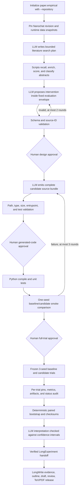

# Nanochat Agentic Empirical Paper

This flagship demonstrates one integrated research program: a pinned existing
repository, literature-grounded experiment design, agent-authored intervention,
controlled trials, audited statistics, and an empirical paper. It is the
reference path for adapting MrMaLiang to another existing model repository.

## Mode contract

| Axis | Value | Consequence |
| --- | --- | --- |
| Paper kind | `empirical` | New experimental claims require an audited result manifest. |
| Evidence profile | `repository` | Nanochat is indexed as code evidence and pinned to the same revision used by the trials. |
| Experiment source | `run` | LongExperiment must complete before LongWrite receives empirical evidence. |
| Experiment authoring | `agentic` | The LLM may propose and implement a bounded intervention; scripts retain the scientific envelope. |

The blueprint pins Nanochat. It fixes the primary metric (`validation_bits_per_byte`,
minimized), baseline and treatment names, controls, three seeds, paired-bootstrap
analysis, and an eight-trial ceiling. The reviewed runtime image must record the
Nanochat tokenizer/data snapshots it actually uses. The agent cannot rewrite
those fields through its proposal.

The blueprint already selects `paper.empirical`; do not replace it with an
`experiment.*` template. It uses the generalized
`repository_optimization` profile, remote-job execution, and a config-bound
authorization lease. See [flagship platform adoption](./platform-adoption.md)
before changing `pilot`, `runner`, or authorization settings.

## Exact workflow



The intellectual and trusted-compute responsibilities are deliberately split:

| Work | Owner |
| --- | --- |
| Search plan, intervention rationale, candidate code, result discussion | LLM stages |
| Git pins, proposal schema, immutable metric/control/seeds, path/file contracts, tests, trial matrix, statistics, checksums, citation/release gates | Scripts |
| Approval of the design, every generated code revision before execution, and full-trial compute | Human through MalaClaw |

Iteration occurs before the full trial suite: compile errors, unit-test failures,
and one-seed smoke failures are returned to the candidate authoring loop. Once
the full multi-seed suite starts, its design is frozen. A negative or
inconclusive result is reported honestly; a different intervention requires a
new approved, preregistered run instead of post-hoc tuning.

## 1. Prerequisites

Complete the root [installation and environment setup](../../README.md#prerequisites).
This flagship additionally requires:

- Python and PyTorch compatible with the pinned Nanochat revision;
- a Modal account and authenticated local Modal CLI; the selected shared Nanochat runtime builds/caches automatically;
- Git access to the pinned public inputs;
- an authenticated Codex or Claude Code runtime; and
- a reviewed compute budget before the second approval.

The current agent-authored execution contract validates and materializes the
candidate on the control plane, but runs candidate tests, smoke work, and full
trials only through the Modal remote-job adapter. File/path validation is still
not an operating-system sandbox, so review the adapter and every generated file
before releasing its execution gate. The bundled adapter implements
submit/status/collect/cancel; its default image contains only Python and PyYAML.
The blueprint selects the maintained `nanochat-gpu-v1` profile, which builds
and caches its pinned Nanochat overlay automatically. During design review,
record actual tokenizer and data/shard snapshot identifiers in the reviewed
provenance. A maintainer may supply an immutable prebuilt override, but normal
contributors do not publish images. See [Remote GPU with Modal](../remote-gpu-modal.md#shared-runtime-catalog-and-nanochat-overlay).
A successful local adapter test is not a live Modal validation.

## 2. Initialize and inspect

```bash
maliang init nanochat-agentic-paper \
  --blueprint nanochat-agentic-empirical-paper

# Verify the copied, workspace-owned Modal adapter without spending GPU time.
(cd nanochat-agentic-paper/experiment && uv sync --project templates/adapters/modal --python 3.12)
(cd nanochat-agentic-paper/experiment && uv run --project templates/adapters/modal python -m unittest discover -s templates/adapters/modal/tests -v)

# Then issue a lease bound to this exact experiment.yaml.
maliang experiment authorize nanochat-agentic-paper \
  --unattended --max-trials 8 --max-gpu-hours 12 --max-wall-hours 24 \
  --expires-in 24 --approved-by <operator-id> --yes

maliang preflight nanochat-agentic-paper --runtime codex
maliang status nanochat-agentic-paper
```

Initialization resolves the repository URL to an immutable Git commit and
writes that exact revision into both:

- `experiment/experiment.yaml` as the trial input; and
- `writing/longwrite.yaml` as the repository evidence snapshot.

Preflight must fail if required pins, approval gates, the sibling writing
workspace, or the agentic execution envelope are missing. Before running,
inspect the metric, direction, control, seed list, conditions, maximum trials,
runtime, and candidate file limits in `experiment/experiment.yaml`.

## 3. Run through the design approval

```bash
maliang run nanochat-agentic-paper --runtime codex

(cd nanochat-agentic-paper/experiment && malaclaw flow report)
(cd nanochat-agentic-paper/experiment && malaclaw flow approve <design-approval-id>)
maliang run nanochat-agentic-paper --runtime codex
```

Review these files before design approval:

- `experiment/agent/validated-proposal.json`
- `experiment/agent/literature-context.json`
- `experiment/reports/experiment-design.md`
- `experiment/runs/trial-plan.json`

Approval means the proposal is scientifically worth implementing under the
declared budget. It does not mean the hypothesis is true.

## 4. Approve generated code, then review smoke evidence

The candidate loop writes a complete JSON source bundle, materializes it under
`experiment/agent/candidate/project/`, overlays it on a copy of the pinned
Nanochat source, compiles Python, discovers `test_*.py`, and runs one baseline and
one treatment smoke measurement with the first seed. Before Python compilation,
tests, or smoke execution, the flow pauses on the generated candidate manifest.

The generated entrypoint receives only the declared execution interface:

- `LONGEXPERIMENT_WORKSPACE`
- `LONGEXPERIMENT_STUDY_ID`
- `LONGEXPERIMENT_CONDITION`
- `LONGEXPERIMENT_SEED`
- `LONGEXPERIMENT_SMOKE`
- `LONGEXPERIMENT_ARTIFACT_DIR`
- `LONGEXPERIMENT_PRIMARY_METRIC`

It must print a final JSON line containing a finite `metric` (or the named
metric in `metrics`) and optional workspace-relative artifact paths.

First inspect every path and checksum in the candidate manifest and every source
file under `experiment/agent/candidate/project/`, then approve execution:

```bash
(cd nanochat-agentic-paper/experiment && malaclaw flow report)
(cd nanochat-agentic-paper/experiment && malaclaw flow approve <candidate-execution-approval-id>)
maliang run nanochat-agentic-paper --runtime codex
```

If tests or smoke fail, the loop authors a new bundle and requires a new code
approval. Once smoke passes, inspect:

- `experiment/agent/candidate/manifest.json`
- `experiment/logs/agent-candidate-tests.log`
- `experiment/agent/smoke-results.json`
- `experiment/reports/agentic-readiness.md`

Then release the full-trial gate:

```bash
(cd nanochat-agentic-paper/experiment && malaclaw flow report)
(cd nanochat-agentic-paper/experiment && malaclaw flow approve <revision-approval-id>)
maliang run nanochat-agentic-paper --runtime codex
```

## 5. Audit and hand off to the paper

LongExperiment executes every baseline/candidate and seed pair. It rejects
missing, duplicate, failed, or extra-budget trials; mismatched source pins;
unsafe/missing artifacts; and runner-supplied conclusions. It derives paired
confidence intervals itself and writes:

- `experiment/results/raw-results.json`
- `experiment/results/experiment-manifest.json`
- `experiment/reports/result-audit.md`
- `experiment/reports/result-interpretation.md`

On the next `maliang run`, the parent coordinator verifies the manifest and
copies bounded empirical packets into LongWrite. The paper may cite trial and
comparison evidence, import checksummed result figures/tables, or render a
paper-specific plot from canonical result data. Repository README figures are
code/repository evidence, never substitutes for experimental evidence.

Continue through the writing approval and release gates as needed:

```bash
maliang writing review agenda nanochat-agentic-paper
maliang writing approve nanochat-agentic-paper <approval-id>
maliang run nanochat-agentic-paper --runtime codex
```

## Expected release artifacts

- `experiment/results/experiment-manifest.json`
- `experiment/reports/result-audit.md`
- `writing/codebases/manifest.json`
- `writing/evidence/experiment-packets.json`
- `writing/paper/main.pdf`
- `writing/reports/run-provenance.json`

This is an executable release-candidate workflow, not a precomputed scientific
claim. Its first public result should be labeled a pilot until a real run has
passed both experiment and manuscript release gates.
