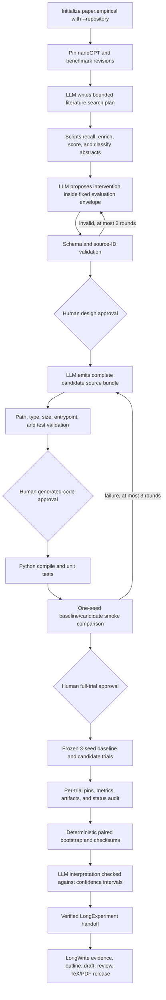

# nanoGPT Agentic Empirical Paper

This flagship demonstrates one integrated research program: a pinned existing
repository, literature-grounded experiment design, agent-authored intervention,
controlled trials, audited statistics, and an empirical paper. It is the
reference path for adapting MrMaLiang to another existing model repository.

## Mode contract

| Axis | Value | Consequence |
| --- | --- | --- |
| Paper kind | `empirical` | New experimental claims require an audited result manifest. |
| Evidence profile | `repository` | nanoGPT is indexed as code evidence and pinned to the same revision used by the trials. |
| Experiment source | `run` | LongExperiment must complete before LongWrite receives empirical evidence. |
| Experiment authoring | `agentic` | The LLM may propose and implement a bounded intervention; scripts retain the scientific envelope. |

The blueprint pins nanoGPT and the character-level Shakespeare data source. It
also fixes the primary metric (`validation_loss`, minimized), baseline and
treatment names, controls, three seeds, paired-bootstrap analysis, and an
eight-trial ceiling. The agent cannot rewrite those fields through its proposal.

## Exact workflow



The intellectual and trusted-compute responsibilities are deliberately split:

| Work | Owner |
| --- | --- |
| Search plan, intervention rationale, candidate code, result discussion | LLM stages |
| Git pins, proposal schema, immutable metric/control/seeds, path/file contracts, tests, trial matrix, statistics, checksums, citation/release gates | Scripts |
| Approval of the design, every generated code revision before execution, and full-trial compute | Human through MalaClaw |

Iteration occurs before the full trial suite: compile errors, unit-test failures,
and one-seed smoke failures are returned to the candidate authoring loop. Once
the full multi-seed suite starts, its design is frozen. A negative or
inconclusive result is reported honestly; a different intervention requires a
new approved, preregistered run instead of post-hoc tuning.

## 1. Prerequisites

Complete the root [installation and environment setup](../../README.md#prerequisites).
This flagship additionally requires:

- Python and PyTorch compatible with the pinned nanoGPT revision;
- enough local CPU/GPU capacity for the configured smoke and full trials;
- Git access to the pinned public inputs;
- an authenticated Codex or Claude Code runtime; and
- a reviewed compute budget before the second approval.

The current agent-authored execution contract runs the generated Python
entrypoint on the machine hosting the MalaClaw worker. File/path validation is
not an operating-system sandbox: use a dedicated worker or container without
unrelated credentials or data, and review every generated file before releasing
its execution gate. The runner supplies a fresh workspace-local `HOME` and only
an allowlisted set of Python/CUDA/cache environment variables; API/provider
credentials are not inherited. This reduces ambient authority but is not a
sandbox. Do not assume that adding Modal credentials moves this
flagship remotely. A future remote adapter must preserve the same candidate,
environment, result, collection, and cancellation contract.

## 2. Initialize and inspect

```bash
maliang init nanogpt-agentic-paper \
  --blueprint nanogpt-agentic-empirical-paper

maliang preflight nanogpt-agentic-paper --runtime codex
maliang status nanogpt-agentic-paper
```

Initialization resolves the repository URL to an immutable Git commit and
writes that exact revision into both:

- `experiment/experiment.yaml` as the trial input; and
- `writing/longwrite.yaml` as the repository evidence snapshot.

Preflight must fail if required pins, approval gates, the sibling writing
workspace, or the agentic execution envelope are missing. Before running,
inspect the metric, direction, control, seed list, conditions, maximum trials,
runtime, and candidate file limits in `experiment/experiment.yaml`.

## 3. Run through the design approval

```bash
maliang run nanogpt-agentic-paper --runtime codex

(cd nanogpt-agentic-paper/experiment && malaclaw flow report)
(cd nanogpt-agentic-paper/experiment && malaclaw flow approve <design-approval-id>)
maliang run nanogpt-agentic-paper --runtime codex
```

Review these files before design approval:

- `experiment/agent/validated-proposal.json`
- `experiment/agent/literature-context.json`
- `experiment/reports/experiment-design.md`
- `experiment/runs/trial-plan.json`

Approval means the proposal is scientifically worth implementing under the
declared budget. It does not mean the hypothesis is true.

## 4. Approve generated code, then review smoke evidence

The candidate loop writes a complete JSON source bundle, materializes it under
`experiment/agent/candidate/project/`, overlays it on a copy of the pinned
nanoGPT source, compiles Python, discovers `test_*.py`, and runs one baseline and
one treatment smoke measurement with the first seed. Before Python compilation,
tests, or smoke execution, the flow pauses on the generated candidate manifest.

The generated entrypoint receives only the declared execution interface:

- `LONGEXPERIMENT_WORKSPACE`
- `LONGEXPERIMENT_STUDY_ID`
- `LONGEXPERIMENT_CONDITION`
- `LONGEXPERIMENT_SEED`
- `LONGEXPERIMENT_SMOKE`
- `LONGEXPERIMENT_ARTIFACT_DIR`
- `LONGEXPERIMENT_PRIMARY_METRIC`

It must print a final JSON line containing a finite `metric` (or the named
metric in `metrics`) and optional workspace-relative artifact paths.

First inspect every path and checksum in the candidate manifest and every source
file under `experiment/agent/candidate/project/`, then approve execution:

```bash
(cd nanogpt-agentic-paper/experiment && malaclaw flow report)
(cd nanogpt-agentic-paper/experiment && malaclaw flow approve <candidate-execution-approval-id>)
maliang run nanogpt-agentic-paper --runtime codex
```

If tests or smoke fail, the loop authors a new bundle and requires a new code
approval. Once smoke passes, inspect:

- `experiment/agent/candidate/manifest.json`
- `experiment/logs/agent-candidate-tests.log`
- `experiment/agent/smoke-results.json`
- `experiment/reports/agentic-readiness.md`

Then release the full-trial gate:

```bash
(cd nanogpt-agentic-paper/experiment && malaclaw flow report)
(cd nanogpt-agentic-paper/experiment && malaclaw flow approve <revision-approval-id>)
maliang run nanogpt-agentic-paper --runtime codex
```

## 5. Audit and hand off to the paper

LongExperiment executes every baseline/candidate and seed pair. It rejects
missing, duplicate, failed, or extra-budget trials; mismatched source pins;
unsafe/missing artifacts; and runner-supplied conclusions. It derives paired
confidence intervals itself and writes:

- `experiment/results/raw-results.json`
- `experiment/results/experiment-manifest.json`
- `experiment/reports/result-audit.md`
- `experiment/reports/result-interpretation.md`

On the next `maliang run`, the parent coordinator verifies the manifest and
copies bounded empirical packets into LongWrite. The paper may cite trial and
comparison evidence, import checksummed result figures/tables, or render a
paper-specific plot from canonical result data. Repository README figures are
code/repository evidence, never substitutes for experimental evidence.

Continue through the writing approval and release gates as needed:

```bash
maliang writing review agenda nanogpt-agentic-paper
maliang writing approve nanogpt-agentic-paper <approval-id>
maliang run nanogpt-agentic-paper --runtime codex
```

## Expected release artifacts

- `experiment/results/experiment-manifest.json`
- `experiment/reports/result-audit.md`
- `writing/codebases/manifest.json`
- `writing/evidence/experiment-packets.json`
- `writing/paper/main.pdf`
- `writing/reports/run-provenance.json`

This is an executable release-candidate workflow, not a precomputed scientific
claim. Its first public result should be labeled a pilot until a real run has
passed both experiment and manuscript release gates.
