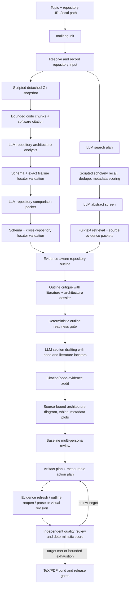

# Agentic Repository Survey Flagship

The matching versioned starting point is the
[repository-survey blueprint](../../examples/flagships/repository-survey/).
This is a survey paper organized around one pinned GitHub or local repository.
It explains architecture, workflows, trade-offs, and related research; it does
not execute the repository or claim new experimental results.

## Mode contract

| Axis | Value |
| --- | --- |
| Paper kind | `survey` |
| Evidence profile | `repository` |
| Experiment source | `none` |
| Experiment authoring | Not applicable |

The public template is `paper.survey`; supplying `--repository` makes the
resolved evidence profile `repository`. The flagship blueprint requires that
input, creates only `writing/`, and records `experimentSource: none`. A
repository alone can therefore never trigger LongExperiment. The repository is
software evidence; it never counts toward the scholarly bibliography gates.

## Exact workflow



The LLM decides the organizing argument, comparisons, architecture explanation,
and prose. Scripts own Git pinning, file/line locators, scholarly metadata,
source packets, citation validation, rendering, and release gates.

For multiple repositories, bounded context is allocated round-robin so every
pinned source reaches analysis before any one repository can consume the global
context budget. A validated comparison packet must cover every repository; each
comparative dimension carries exact locators from every repository it compares.
Popularity and stars are never comparison evidence.

## Initialize and rehearse

```bash
maliang init repo-study \
  --blueprint repository-survey \
  --repository https://github.com/your-org/your-repository.git \
  --reference-link https://arxiv.org/abs/2401.01234  # replace with the real paper

maliang preflight repo-study --runtime codex
maliang run repo-study --runtime codex
```

The blueprint targets approximately 10,000 words, 12 woven scholarly sources,
three figures, three tables, at least one comparison table, and at least one
verified-metadata plot. It uses author–year citations and the standard research
breadth profile. These are measurable release targets, not page-count promises.

Use a local path when studying an unpublished checkout:

```bash
maliang init local-repo-study \
  --blueprint repository-survey \
  --repository /absolute/path/to/repository
```

Before publication, inspect `writing/longwrite.yaml` and replace any symbolic
ref with an immutable commit. The evidence stage itself resolves a detached
commit and records it in `writing/codebases/manifest.json`.

## Evidence and citation rules

Use repository locators for implementation facts:

```text
[codebase:repo-example:src/engine.ts#L20-L48]
```

Use scholarly source locators for research claims:

```text
[source:source-id:p12]
```

The workflow creates separate bibliography entries for software and papers.
If the repository has a published paper, the final manuscript should cite both:

- the pinned software citation for implementation/version facts;
- the original scholarly paper for the method, evaluation, and published
  conclusions.

`README` and `CITATION.cff` are indexed as code evidence, but they are not
automatically trusted as scholarly evidence. Add the paper URL/DOI through the
first-class `--reference-link` option when necessary. Recognized arXiv, DOI,
and OpenReview links become exact scholarly seeds and must resolve successfully
before they can support claims. Figures
or result tables published by the repository remain author-reported evidence,
not new empirical results from MrMaLiang.

When present, `CITATION.cff` supplies the software title, authors, release date,
version, DOI, and repository URL for `sources/codebases.bib`; otherwise the
pinned Git commit supplies conservative fallback metadata. Release requires
every primary repository to appear in chapter prose with a `[codebase:<id>]`
locator. Unused supplementary repositories are named in the validation report
instead of being silently presented as used.

Pinned README/CITATION text is scanned for at most 40 mentioned GitHub
repositories. They are written to `codebases/mentioned-repositories.json` as
operator candidates only—not fetched, selected, cited, or recursively crawled.

## Existing repository figures

A repository figure can be reused only when its pinned path, checksum, license,
title, caption, attribution, and insight are declared in `longwrite.yaml`:

```yaml
research:
  repository_figures:
    - id: architecture-overview
      codebase_id: repo-example
      path: docs/architecture.svg
      title: Repository architecture
      caption: Architecture supplied by the repository maintainers.
      insight: The figure documents component boundaries; it is not experimental evidence.
      license: MIT
```

Repository plots may describe what the original authors report, with the
original paper cited. They do not become new empirical evidence merely because
they are checked into Git. New-result claims require the empirical workflow and
an audited LongExperiment manifest.

## Approval, recovery, and outputs

The default outline approval is automatic after the bounded critique loop;
change it to `human` in `writing/longwrite.yaml` when the organizing taxonomy
needs explicit sign-off. Use:

```bash
maliang status repo-study
maliang writing review agenda repo-study
maliang writing approve repo-study --batch
maliang run repo-study --runtime codex
```

Canonical outputs include:

```text
writing/codebases/manifest.json
writing/evidence/codebase-chunks.jsonl
writing/evidence/codebase-analysis.raw.json
writing/evidence/codebase-analysis.json
writing/reports/codebase-analysis-repair.md
writing/evidence/codebase-comparison.raw.json
writing/evidence/codebase-comparison.json
writing/reports/codebase-comparison-repair.md
writing/codebases/mentioned-repositories.json
writing/evidence/source-packets.json
writing/evidence/citation-ledger.jsonl
writing/sources/bibliography.bib
writing/reviews/scorecard.json
writing/paper/main.pdf
writing/reports/run-provenance/<timestamp>.json
```

This flagship needs Git, a live Codex/Claude runtime, research-provider access,
and PDF tooling. It does not need a GPU or Modal.

## Dashboard configuration

The LongWrite dashboard exposes **Repository evidence** in both workspace
creation and the durable `longwrite.yaml` editor. One Git URL or local Git path
per line automatically selects `repository_study`; an empty field selects
`literature_survey`. The dashboard creation path always sets `paper_kind:
survey`, and adding a repository never executes it or starts LongExperiment.
It also exposes the same bounded GitHub-discovery budgets as `maliang init`.

To discover repository evidence instead of supplying a known URL:

```bash
maliang init discovered-repo-study \
  --template paper.survey \
  --topic "Agentic literature-review software architectures" \
  --discover-repositories \
  --repository-query-budget 4 \
  --repository-max-selected 3
```

```bash
maliang writing dashboard --install-only
malaclaw dashboard-extensions doctor
maliang writing dashboard
```

The dashboard is an operator surface over the same compiled workflow shown
above. It does not define a shorter or less rigorous repository pipeline.
