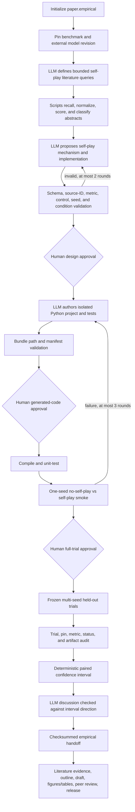

# Self-Play Autonomous Empirical Paper

This flagship demonstrates the most open-ended supported experiment path: the
topic begins with literature and fixed public benchmark/model inputs, but no
central implementation repository. The LLM proposes a bounded self-play method,
authors a minimal Python experiment project, receives test/smoke feedback, and
then hands audited trials to an empirical-paper workflow.

## Mode contract

| Axis | Value | Consequence |
| --- | --- | --- |
| Paper kind | `empirical` | The manuscript reports newly executed trials. |
| Evidence profile | `literature` | Prior work, not an existing code repository, organizes the paper. |
| Experiment source | `run` | LongExperiment must produce and certify the result bundle. |
| Experiment authoring | `agentic` | The LLM designs and implements the treatment inside fixed scientific and compute guardrails. |

“From scratch” does not mean unconstrained. The blueprint pins the arithmetic
benchmark and model revision, and fixes exact-match maximization, the no-self-play
baseline, the treatment name, held-out split, controls, three seeds,
paired-bootstrap analysis, approvals, and an eight-trial ceiling.

## Exact workflow



The two loops have different purposes. Proposal repair makes the research idea
conform to verified literature and the preregistered envelope. Candidate repair
uses compiler, unit-test, and one-seed smoke evidence to make that approved idea
executable. Neither loop may change the frozen metric, controls, seeds, benchmark,
model revision, or full-trial ceiling.

There is intentionally no automatic “try another method until significant”
loop after the full suite. Negative and inconclusive outcomes remain valid
results. A materially new method is a new approved experiment program.

## 1. Prerequisites and cost boundary

Complete the root [installation and environment setup](../../README.md#prerequisites).
This flagship additionally needs:

- Python and a tested environment for the pinned model and benchmark;
- access to the externally pinned model revision;
- an authenticated Codex or Claude Code runtime;
- sufficient local compute for the candidate smoke and frozen trial suite; and
- an operator-approved compute and data-use policy.

The current agent-authored entrypoint executes on the MalaClaw worker host. Path
validation is not an OS sandbox: use a dedicated worker/container without
unrelated credentials or data, and review every generated file before approving
execution. Generated processes receive a workspace-local `HOME` and only an
allowlisted Python/CUDA/cache environment; API/provider credentials are not
inherited. A Modal account is not required and merely configuring one does not
remote this workflow. Remote execution must later use a reviewed adapter that
preserves submit/status/collect/cancel, the same immutable candidate, and the
same result contract.

## 2. Initialize and inspect the envelope

```bash
maliang init self-play-agentic-paper \
  --blueprint self-play-autonomous-empirical-paper

maliang preflight self-play-agentic-paper --runtime codex
maliang status self-play-agentic-paper
```

Review `experiment/experiment.yaml` before any run. In particular, confirm the
model/benchmark revisions, licenses and access rules, held-out split, exact-match
evaluator, conditions, seeds, maximum trials, runtime ceiling, and candidate
file limits. Adjusting these after viewing results invalidates the original
experiment and should create a new run.

## 3. Run and approve the literature-grounded design

```bash
maliang run self-play-agentic-paper --runtime codex

(cd self-play-agentic-paper/experiment && malaclaw flow report)
(cd self-play-agentic-paper/experiment && malaclaw flow approve <design-approval-id>)
maliang run self-play-agentic-paper --runtime codex
```

Before approving, inspect:

- `experiment/agent/literature-context.json`
- `experiment/agent/validated-proposal.json`
- `experiment/reports/experiment-design.md`
- `experiment/runs/trial-plan.json`

The validated proposal must reference known literature source IDs and must
exactly reproduce the configured metric, direction, baseline, treatment,
control text, and seed order.

## 4. Approve implementation, then run one-seed smoke

The LLM emits a complete declarative candidate bundle. Scripts reject absolute
or traversing paths, unsupported file types, excessive file count/size, a
missing `maliang_runner.py`, or missing `test_*.py`. The isolated project is
compiled and unit-tested only after a human releases its execution gate.

The entrypoint receives the same `LONGEXPERIMENT_*` interface documented in the
[nanoGPT flagship](./nanogpt-agentic-empirical-paper.md#4-approve-generated-code-then-review-smoke-evidence)
and must return only measured numeric output plus existing workspace-relative
artifacts.

Inspect every generated file under `experiment/agent/candidate/project/` and its
manifest before allowing any generated Python to execute:

```bash
(cd self-play-agentic-paper/experiment && malaclaw flow report)
(cd self-play-agentic-paper/experiment && malaclaw flow approve <candidate-execution-approval-id>)
maliang run self-play-agentic-paper --runtime codex
```

A revised bundle requires another code approval. After tests and smoke pass,
inspect their logs, rows, and readiness report. If they are scientifically and
operationally acceptable, approve the frozen suite:

```bash
(cd self-play-agentic-paper/experiment && malaclaw flow report)
(cd self-play-agentic-paper/experiment && malaclaw flow approve <revision-approval-id>)
maliang run self-play-agentic-paper --runtime codex
```

## 5. Frozen trials, audit, and manuscript

For each declared seed, the suite runs both `no-self-play` and
`agent-self-play`. LongExperiment then verifies the complete condition/seed
matrix, input revisions, finite primary metrics, completion state, artifact
paths, and trial ceiling. Statistics are recomputed from audited records; the
candidate cannot self-certify publication eligibility.

The LLM may label the outcome `supported`, `not_supported`, or `inconclusive`,
but a script checks that label against the configured direction and confidence
interval. The verified manifest is then handed to LongWrite as bounded
experiment packets before outlining and drafting.

Resume at each writing approval gate:

```bash
maliang writing review agenda self-play-agentic-paper
maliang writing approve self-play-agentic-paper <approval-id>
maliang run self-play-agentic-paper --runtime codex
```

LongWrite independently rebuilds literature evidence for the manuscript. It
must distinguish prior claims from new experimental claims and attach every new
result claim to a comparison/trial packet. It may import checksummed experimental
figures or render plots from canonical trial data; it may not invent charts from
the narrative.

## Expected release artifacts

- `experiment/agent/validated-proposal.json`
- `experiment/agent/candidate/manifest.json`
- `experiment/results/experiment-manifest.json`
- `experiment/reports/result-audit.md`
- `writing/evidence/experiment-packets.json`
- `writing/paper/main.pdf`
- `writing/reports/run-provenance.json`

This workflow generalizes to a new literature-driven computational idea by
changing the pinned inputs and evaluation envelope. Domain-specific safety,
ethics, data licensing, wet-lab work, unrestricted shell generation, and hidden
benchmark access are outside this flagship’s authorization.
